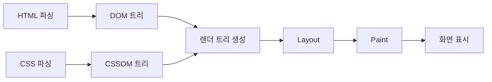

# 브라우저가 화면을 그리는 과정

웹 브라우저는 서버로부터 받은 HTML과 CSS를 파싱하여 화면에 픽셀로 변환합니다.

## 렌더링 단계
1. **DOM & CSSOM 트리 생성:** HTML과 스타일시트 파싱
2. **렌더 트리(Render Tree) 구축:** 화면에 실제로 표시될 요소 결합
3. **레이아웃(Layout / Reflow):** 각 노드의 정확한 위치와 크기 계산
4. **페인트(Paint):** 픽셀 단위로 색칠하는 과정
5. **컴포지팅(Compositing):** 레이어 합성

자바스크립트 실행은 메인 스레드를 점유하므로 렌더링 성능에 직접적인 영향을 줍니다.

## 브라우저 렌더링 파이프라인 다이어그램

## 성능 복잡도 수식 테스트

렌더 트리를 순회하는 시간 복잡도는 노드의 개수 $N$에 대해 $O(N)$의 선형 시간을 가집니다.

블록 수식 예시:

$$
\text{Total Render Time} = \sum_{i=1}^{n} (T_{\text{layout}} + T_{\text{paint}})
$$