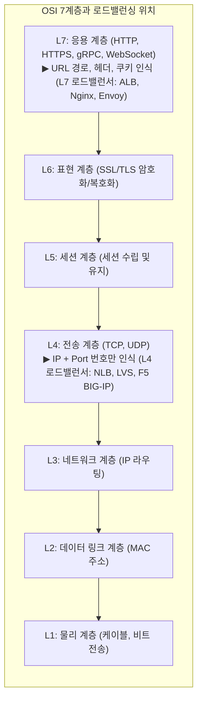
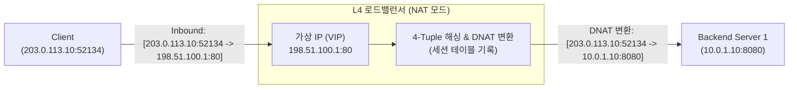
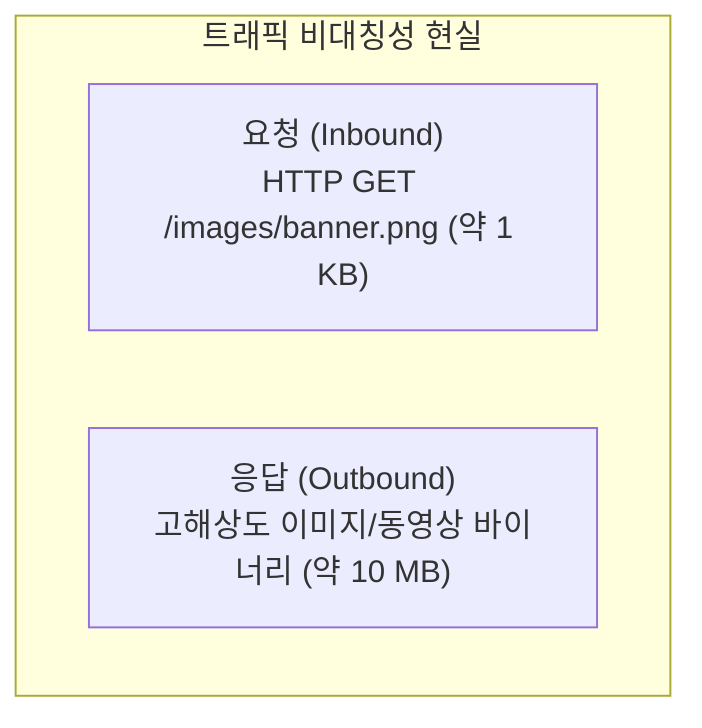
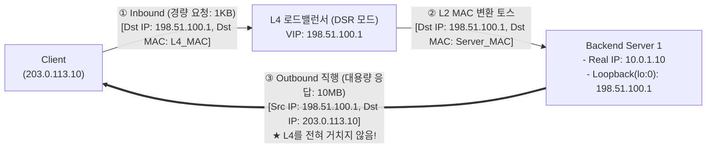
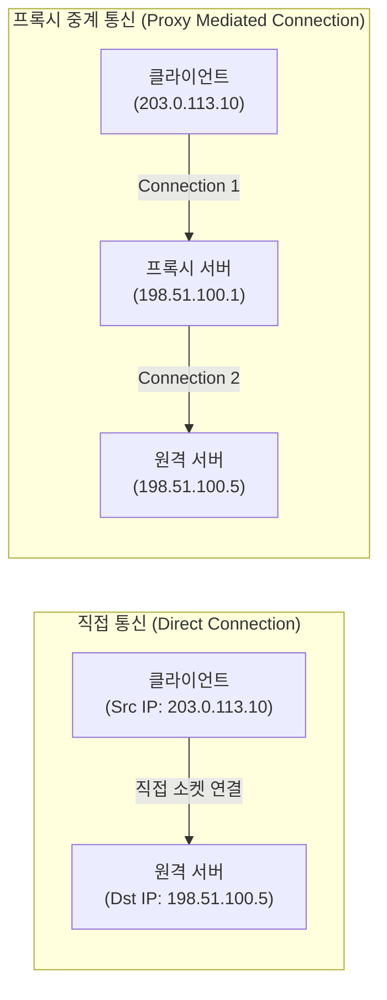
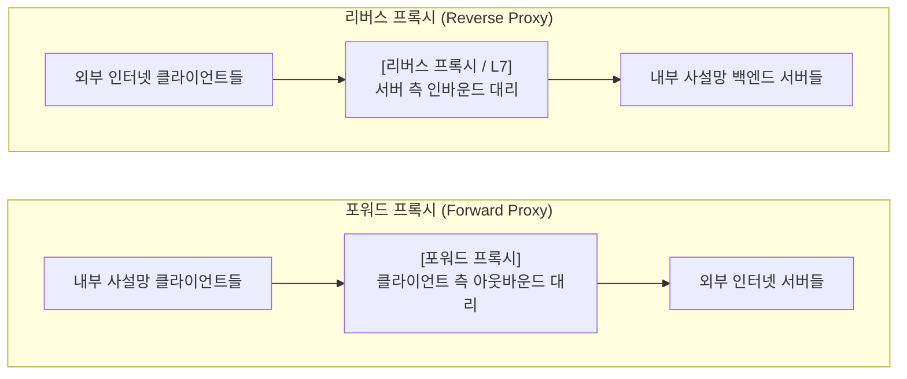
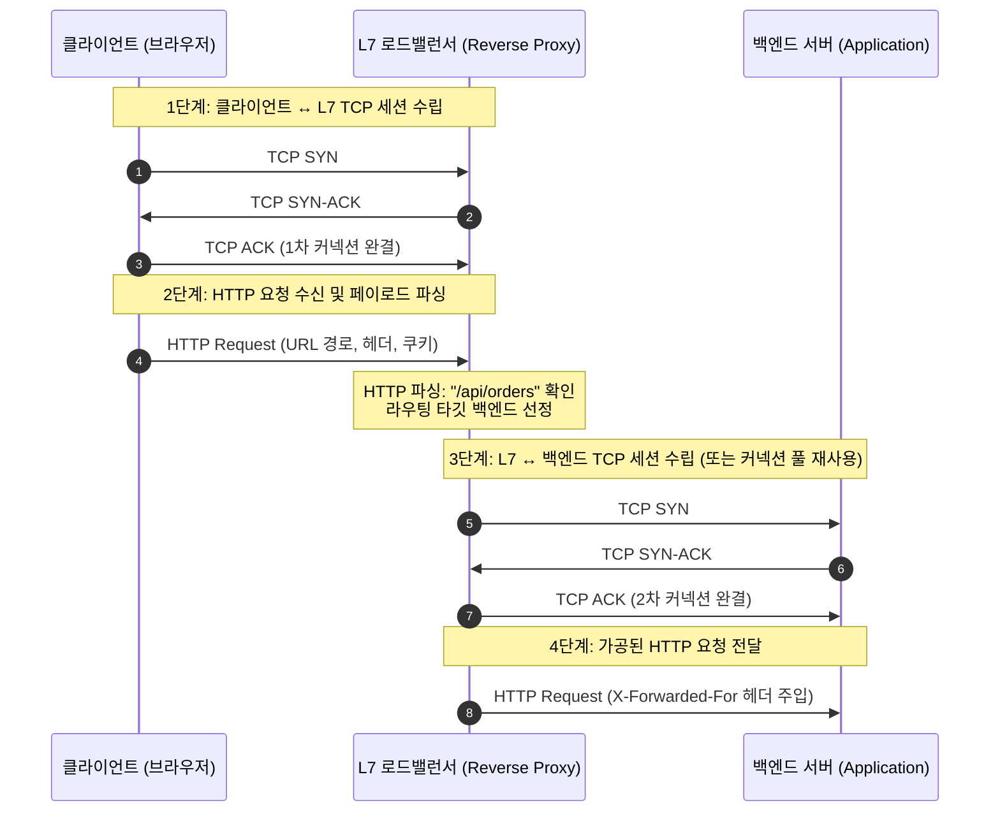
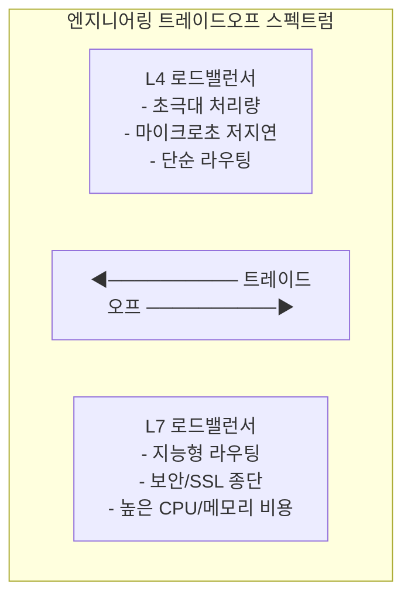
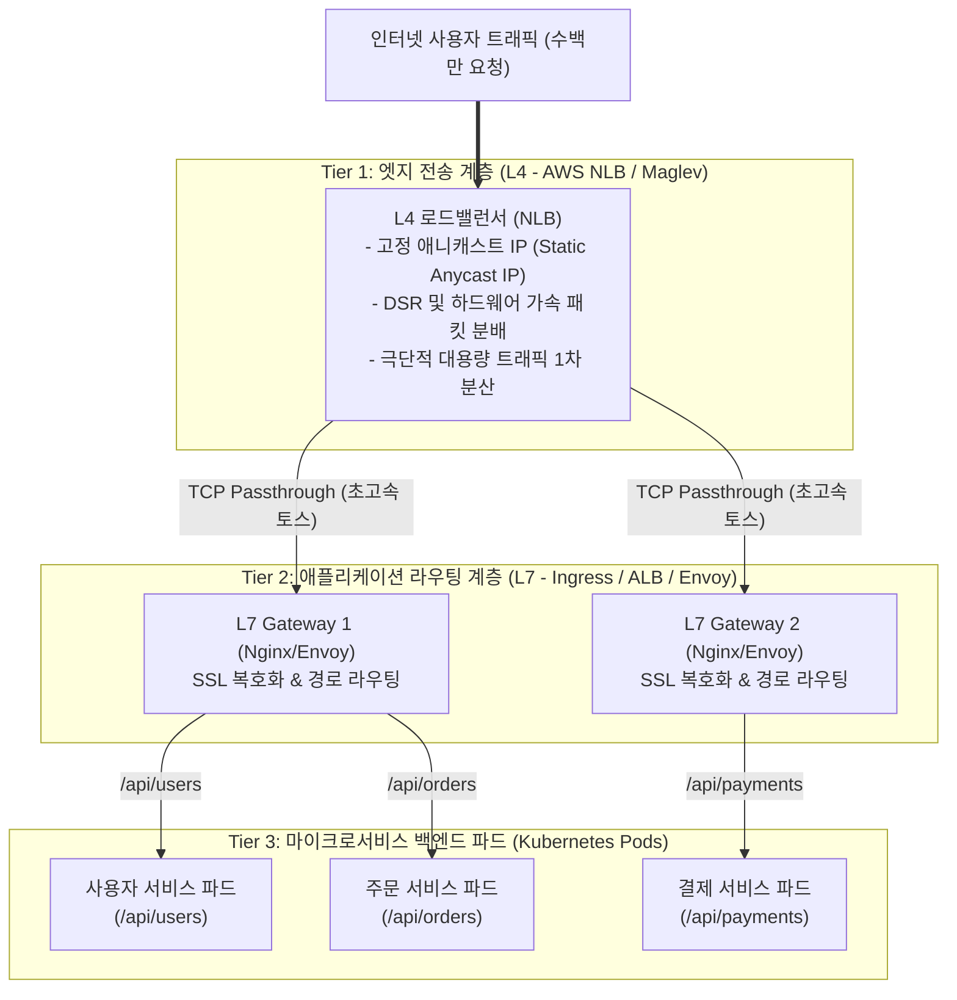

> 트래픽 폭증을 분산시키는 로드밸런서의 본질을 OSI 계층 관점에서 해부하고, L4의 패킷 조작(NAT, DSR)과 L7의 리버스 프록시 동작 메커니즘 및 2계층 아키텍처를 심층 분석한다.

---

## 1. 부하 분산과 OSI 계층

단일 서버의 물리적 한계를 극복하고 수평 확장을 달성하기 위해 부하 분산기는 네트워크의 어느 계층에서 트래픽을 처리할지 결정해야 한다.

현대 인터넷 서비스에서 단일 물리 머신의 하드웨어 사양(CPU, 메모리, 네트워크 인터페이스 카드)을 끌어올리는 스케일 업(Scale-Up)은 명확한 물리적 한계와 기하급수적인 비용 증가를 수반한다. 따라서 수십, 수백 대의 범용 서버를 병렬로 배치하고 사용자 트래픽을 고르게 나누어 처리하는 **스케일 아웃(Scale-Out)**이 시스템 엔지니어링의 표준 전략이 되었다.

이때 트래픽의 관문에 서서 여러 백엔드 서버로 요청을 분배해 주는 핵심 컴포넌트가 바로 **로드밸런서(Load Balancer, 부하 분산기)**다.

네트워크 통신의 표준 규격인 OSI 7계층에서 상위 계층으로 올라갈수록 로드밸런서가 들여다볼 수 있는 정보의 **해상도(Resolution)**는 높아진다.
* **L4 (전송 계층)**: 패킷의 IP 주소와 포트(Port) 번호, 프로토콜(TCP/UDP) 정보까지만 확인한다. 패킷 내부의 HTTP 요청이나 사용자 데이터는 암호화 여부와 상관없이 들여다보지 않는다.
* **L7 (응용 계층)**: 전송 계층 위의 페이로드를 완전히 조립하고 해독하여 HTTP 메서드, URL 경로, HTTP 헤더, 쿠키, JSON 본문까지 모두 확인한다.

그러나 정보의 해상도가 높아진다는 것은 그만큼 패킷을 풀어서 버퍼링하고, TCP 연결을 유지하며, 데이터를 파싱하는 데 **더 많은 CPU 연산과 메모리**가 소모됨을 의미한다. 이것이 바로 로드밸런서가 L4와 L7이라는 두 가지 거대한 진영으로 나뉜 근본적인 공학적 이유다.

---

## 2. L4 로드밸런서 패킷 제어 원리

L4 로드밸런서는 TCP 연결의 종단점이 되지 않고, 패킷 헤더 정보만을 기반으로 트래픽을 초고속으로 중계하는 교차로 역할을 수행한다.

L4 로드밸런서(AWS NLB, Linux LVS, F5 BIG-IP 등)의 가장 중요한 본질은 **"애플리케이션 계층의 데이터(HTTP 본문, URL 등)를 전혀 신경 쓰지 않는다"**는 점이다. L4는 들어오는 IP 패킷의 헤더에서 오직 4개(또는 프로토콜 포함 5개)의 튜플 정보만을 읽어 분산 대상을 결정한다.

$$\text{5-Tuple} = \{\text{Source IP}, \text{Source Port}, \text{Destination IP}, \text{Destination Port}, \text{Protocol}\}$$

### 1) NAT (Network Address Translation) 모드 동작 과정
L4가 패킷을 백엔드로 전달하는 가장 고전적이면서 직관적인 방식은 **목적지 주소 변환(DNAT, Destination NAT)**이다.

1. **클라이언트의 인바운드 패킷 송신**:
   * 출발지: `203.0.113.10:52134` (클라이언트 공인 IP)
   * 목적지: `198.51.100.1:80` (로드밸런서 대표 가상 IP, VIP)
2. **L4의 목적지 주소 변환 (DNAT)**:
   * L4는 패킷의 4-Tuple을 해싱하여 백엔드 서버 풀 중 `10.0.1.10:8080`을 선택한다.
   * 패킷의 목적지 IP와 포트를 백엔드 서버의 실제 IP(`10.0.1.10:8080`)로 바꿔치기한다.
   * L4는 내부 **세션 테이블(Session Table)**에 `203.0.113.10:52134 ↔ 10.0.1.10:8080` 매핑을 기록해 둔다.
3. **백엔드 서버의 응답과 출발지 주소 변환 (SNAT)**:
   * 백엔드 서버가 응답을 보낼 때, 출발지는 `10.0.1.10:8080`, 목적지는 `203.0.113.10:52134`가 된다.
   * 이 응답 패킷은 반드시 다시 L4 로드밸런서를 거쳐야 한다. 만약 백엔드가 클라이언트에게 직접 응답하면, 클라이언트는 자신이 요청했던 `198.51.100.1:80`이 아닌 엉뚱한 사설 IP(`10.0.1.10`)로부터 패킷을 받게 되므로 패킷을 폐기(Drop)해 버리기 때문이다.
   * L4는 세션 테이블을 조회하여 출발지 주소를 다시 `198.51.100.1:80`(VIP)으로 변환(SNAT)한 후 클라이언트에게 전달한다.

### 2) L4 세션 테이블의 역할
L4는 TCP 핸드셰이크를 자신이 직접 맺지 않는다. 클라이언트가 보내는 `TCP SYN` 패킷, 서버의 `SYN-ACK`, 클라이언트의 `ACK` 패킷을 중간에서 주소만 바꾸어 그대로 토스(Passthrough)한다.

하지만 TCP는 상태가 있는(Stateful) 연결 지향 프로토콜이므로, 동일한 TCP 연결에 속한 모든 후속 데이터 패킷(`PSH`, `ACK`, `FIN`)은 반드시 **처음에 연결이 수립되었던 동일한 백엔드 서버**로 가야만 한다. 이를 보장하기 위해 L4는 커널 메모리에 초경량 세션 테이블을 유지하며, 들어오는 패킷이 기존 연결에 속해 있는지 검사하여 일관된 라우팅을 유지한다.

---

## 3. DSR과 반환 트래픽 병목 돌파

웹 트래픽의 극단적인 인아웃 비대칭성을 해결하기 위해 응답 패킷이 로드밸런서를 우회하는 DSR 기술이 고안되었다.

앞서 살펴본 NAT 모드에는 인터넷 서비스의 특성상 피할 수 없는 치명적인 구조적 병목이 존재한다. 바로 **인바운드와 아웃바운드 트래픽의 비대칭성(Traffic Asymmetry)**이다.

* 사용자가 서버로 보내는 HTTP 요청 패킷은 기껏해야 수백 바이트에서 수 킬로바이트(KB)에 불과하다.
* 반면 서버가 사용자에게 돌려주는 응답(HTML, 고화질 이미지, 스트리밍 영상, 대용량 JSON)은 수 메가바이트(MB)에서 수 기가바이트에 달한다.

NAT 방식에서는 들어올 때뿐만 아니라 **나가는 10,000배 큰 응답 트래픽까지 전부 L4 장비의 대역폭을 통과**해야 한다. 결과적으로 수백 대의 백엔드 서버가 뿜어내는 응답 트래픽에 짓눌려 L4 장비의 네트워크 인터페이스가 먼저 포화 상태에 이르고 시스템 전체가 뻗어버린다.

### 1) DSR (Direct Server Return)의 동작 메커니즘
이 병목을 해소하기 위해 고안된 아키텍처가 바로 **DSR(Direct Server Return, 직접 서버 반환)**이다. DSR의 핵심 아이디어는 단순하고 명쾌하다: **"들어올 때는 L4를 거치되, 나갈 때는 L4를 완전히 우회하여 클라이언트에게 직행한다."**

### 2) DSR의 물리적 구현 트릭: MAC 주소 변환과 Loopback IP
그렇다면 백엔드 서버가 L4를 거치지 않고 직접 클라이언트에게 패킷을 보낼 때, 클라이언트가 패킷을 버리지 않게 만들려면 어떻게 해야 할까?

1. **IP 헤더 불변과 L2 MAC 주소 교체**:
   * L4는 패킷의 IP 헤더(`Src: Client_IP, Dst: VIP`)를 **절대 수정하지 않는다.**
   * 대신 데이터 링크 계층(L2)의 **목적지 MAC 주소만 백엔드 서버의 물리 NIC MAC 주소로 바꿔치기**하여 스위치 네트워크로 흘려보낸다.
2. **백엔드 서버의 Loopback 인터페이스 트릭**:
   * 백엔드 서버의 물리 랜카드(`eth0`)는 사설 IP(`10.0.1.10`)를 갖는다. 하지만 수신된 패킷의 목적지 IP는 여전히 VIP(`198.51.100.1`)다. 일반적인 서버라면 자기 주소가 아니므로 즉시 패킷을 폐기(Drop)한다.
   * 이를 해결하기 위해 백엔드 서버의 **루프백(Loopback, `lo:0`) 가상 네트워크 인터페이스에 VIP(`198.51.100.1`)를 등록**해 둔다.
   * 패킷이 물리 랜카드를 통과해 커널로 올라올 때, OS는 자기 머신 안의 인터페이스 목록을 확인한다. `lo:0`에 목적지 IP와 동일한 VIP가 등록되어 있으므로, OS는 **"아, 이 패킷은 내가 처리해야 할 내 패킷이 맞구나!"**라고 인식하고 패킷을 버리지 않고 애플리케이션으로 넘겨준다.
3. **ARP 무응답(ARP Ignore) 설정**:
   * 네트워크의 모든 백엔드 서버가 루프백에 동일한 VIP를 가지고 있으면, 게이트웨이 라우터가 "이 VIP(`198.51.100.1`)를 가진 장비의 MAC 주소가 무엇이냐?" 하고 ARP 요청을 브로드캐스트할 때 모든 서버가 동시에 손을 들어 심각한 IP 충돌이 발생한다.
   * 따라서 백엔드 서버의 리눅스 커널 파라미터(`arp_ignore=1`, `arp_announce=2`)를 설정하여, 루프백 인터페이스에 할당된 VIP에 대해서는 **물리 네트워크의 ARP 질의에 절대 응답하지 못하도록 침묵**시킨다. ARP에는 오직 L4 로드밸런서만 응답해야 한다.
4. **출발지 IP가 VIP로 유지되는 다이렉트 응답**:
   * 백엔드 애플리케이션이 요청을 처리하고 소켓을 통해 응답을 보낼 때, 리눅스 커널 소켓 계층은 **패킷을 수신했던 목적지 주소(`198.51.100.1`)를 자연스럽게 응답 패킷의 출발지 IP(Source IP)로 설정**한다.
   * 백엔드 서버는 L4 장비를 거칠 필요 없이, 기본 게이트웨이 라우터를 통해 클라이언트(`203.0.113.10`)로 패킷을 직접 쏜다.
   * 클라이언트 입장에서는 자신이 처음에 요청을 보냈던 VIP(`198.51.100.1`)로부터 온 정확한 응답을 받았으므로, 중간에 L4가 빠져나갔다는 사실조차 모른 채 완벽하게 통신을 완결한다.

> [!TIP]
> **빅테크의 대규모 트래픽 처리 비결**
> Google의 로드밸런서 **Maglev**, Naver의 L4 시스템, Netflix의 스트리밍 인프라가 초당 수백만 개의 요청(QPS)을 거뜬히 처리할 수 있는 물리적 비결이 바로 이 DSR 아키텍처다. L4는 가벼운 인바운드 헤더 변환만 처리하고, 거대한 기가비트급 아웃바운드 트래픽은 백엔드 서버들이 인터넷 망으로 직접 뿜어내기 때문이다.

> [!NOTE]
> **심층 분석: DSR의 동작 원리, 왜 루프백(lo) 인터페이스인가?**
> 
> **1. 루프백(Loopback)이란 도대체 무엇인가?**
> * 인터넷 랜선을 완전히 뽑아버려도 브라우저에서 `http://localhost:8080`을 치면 내 컴퓨터에서 띄운 서버에 정상 접속된다. 이것이 가능한 이유가 바로 **루프백(Loopback, `lo`)** 덕분이다.
> * 컴퓨터에는 랜선이 꽂히는 물리적 랜카드(`eth0`) 외에도, OS 커널이 메모리상에 가상으로 만들어 둔 **"선이 없는 소프트웨어 랜카드"**가 기본 탑재되어 있다.
> * 밖으로 패킷을 보내지 않고 커널 메모리 안에서 **유턴(Loop Back)하여 자기 자신에게 되돌려주는 통로**라고 해서 '루프백'이라 불린다.
> 
> **2. DSR은 왜 이 루프백을 이용하는가? (3대 의문과 해답)**
> 원래는 내부 테스트용으로 쓰이던 루프백을, DSR에서는 **"외부와 물리선이 단절되어 있어 ARP 충돌을 일으키지 않는 최고의 은밀한 가상 IP 보관소"**로 영리하게 재활용한다.
> 
> * **Q1. 루프백(lo)은 `127.0.0.1(localhost)` 전용 아닌가? 공인 IP나 VIP를 넣어도 되는가?**
>   - `127.0.0.1`은 기본 등록된 대표 주소일 뿐이다. 루프백은 소프트웨어 인터페이스이므로, 리눅스에서는 `ip addr add 198.51.100.1/32 dev lo`처럼 원하는 임의의 IP(VIP)를 얼마든지 추가 가상 주소(`lo:0`)로 바인딩할 수 있다.
> 
> * **Q2. 물리 랜카드(`eth0`)로 들어온 패킷을 왜 엉뚱한 루프백(`lo`)이 수락하는가?**
>   - 리눅스 커널의 독특한 **'약한 호스트 모델(Weak Host Model)'** 덕분이다.
>   - 강한 호스트 모델(Strong Host Model)을 쓰는 OS는 "물리 랜카드 `eth0`로 들어온 패킷은 오직 `eth0`에 등록된 IP여야만 한다"며 패킷을 버린다.
>   - 하지만 리눅스는 **"패킷이 어떤 물리 랜카드(eth0)로 들어왔든 상관없이, 목적지 IP가 이 컴퓨터 안의 어떤 인터페이스(lo 포함)에라도 등록되어 있다면 내 호스트의 패킷으로 인정하고 받아들인다"**는 규칙을 따른다. 따라서 `eth0`로 들어온 VIP 패킷이라도 `lo`에 VIP가 있으면 커널이 기꺼이 수신한다.
> 
> * **Q3. 왜 물리 랜카드의 서브 인터페이스(`eth0:0`)가 아니라 굳이 루프백(`lo`)이어야 하는가?**
>   - 만약 물리 랜카드(`eth0:0`)에 VIP를 등록하면, 외부에서 "이 VIP 가진 놈 누구냐?" 하고 묻는 ARP 브로드캐스트가 케이블을 타고 들어왔을 때 랜카드가 반사적으로 "나다!" 하고 응답해 버려 L4와 심각한 IP 충돌이 일어난다.
>   - 반면 **루프백(`lo`)은 물리적 선(Wire)이 아예 없는 고립된 인터페이스**이므로, 외부 네트워크에 자신의 존재를 자발적으로 떠벌리지 않는다. 여기에 커널의 `arp_ignore=1` 설정까지 더해지면 외부 ARP 질의에 대해 완벽하게 침묵을 유지할 수 있어 충돌이 원천 차단된다.

---

## 4. L7 로드밸런서와 리버스 프록시

L7 로드밸런서는 클라이언트와 백엔드 서버 사이에서 두 개의 독립된 TCP 연결을 맺고 페이로드를 직접 해석하는 리버스 프록시다.

### 1) 프록시(Proxy)의 정의와 중계 아키텍처
L7 로드밸런서의 기본 동작 구조를 이해하기 위해서는 네트워크 중계자로서의 **프록시(Proxy)** 개념을 명확히 정의해야 한다.

컴퓨터 네트워크에서 프록시란 **두 통신 종단(End-to-End) 사이에서 트래픽을 가로채어 양측을 대리(Act on behalf of)하여 요청과 응답을 중계하는 중개 시스템(Intermediary)**을 의미한다.

직접 통신 대신 프록시 계층을 네트워크 경로에 개입시키는 공학적 목적은 다음과 같다:
1. **네트워크 토폴로지 은폐 (보안)**: 송신자와 수신자의 실제 IP 주소를 서로에게 노출하지 않고 프록시의 IP로 대체하여 인프라 내부 구조를 은닉한다.
2. **인라인 트래픽 검사 및 정책 적용**: 데이터 페이로드가 프록시를 통과하므로 유해 트래픽 필터링, WAF(웹 방화벽) 룰 적용, 데이터 유출 방지(DLP)를 수행할 수 있다.
3. **정적 응답 캐싱**: 동일한 요청에 대해 원격 서버까지 질의하지 않고 프록시 로컬 캐시에서 즉시 응답을 반환하여 백엔드 부하를 경감한다.
4. **트래픽 부하 분산 (Load Balancing)**: 다수의 백엔드 서버 풀로 트래픽을 정책에 따라 분배한다.

### 2) 포워드 프록시와 리버스 프록시의 구조적 차이
프록시는 트래픽의 전송 경로상에서 **'어느 엔드포인트를 보호하고 대리하는가'**에 따라 포워드 프록시와 리버스 프록시로 엄격히 구분된다.

* **포워드 프록시 (Forward Proxy)**:
  - **배치 위치**: 클라이언트 네트워크 내부 또는 사내망 게이트웨이.
  - **동작 방식**: 클라이언트가 외부 인터넷으로 발송하는 아웃바운드(Outbound) 요청을 가로채어 목적지 서버로 대신 전달한다.
  - **주요 목적**: 사내망 클라이언트의 실제 IP 은폐, 특정 외부 도메인 접근 차단(보안 통제), 외부 웹 리소스 캐싱.
* **리버스 프록시 (Reverse Proxy)**:
  - **배치 위치**: 백엔드 서버 클러스터 최전방 인프라 엣지.
  - **동작 방식**: 외부 클라이언트로부터 유입되는 인바운드(Inbound) 요청을 단일 진입점에서 수신하여, 내부 사설망의 여러 백엔드 서버로 분산 전달한다.
  - **주요 목적**: 실제 백엔드 서버의 사설 IP 및 인프라 구조 은닉, 단일 진입점을 통한 보안 및 인증 통합, 부하 분산(Load Balancing), SSL 종단.
  - **L7 로드밸런서(AWS ALB, Nginx, Envoy)는 리버스 프록시 아키텍처를 기반으로 동작한다.**

### 3) L4와 L7의 데이터 해석 및 라우팅 차이
L4와 L7 로드밸런서는 백엔드 서버 풀로 트래픽을 분산한다는 목표는 동일하지만, 참조하는 네트워크 계층과 데이터 해석 범위가 근본적으로 다르다.

* **L4 로드밸런서 (전송 계층)**:
  - TCP/UDP 헤더의 IP 주소와 포트 번호(4-Tuple)만을 참조한다.
  - 애플리케이션 데이터(HTTP 요청 내용, URL, 헤더)를 일절 검사하거나 해석하지 않고 패킷 단위로 단순 포워딩한다.
* **L7 로드밸런서 (응용 계층)**:
  - TCP 3-Way Handshake를 완료하여 연결을 종단한 후, 수신된 HTTP/HTTPS 페이로드를 직접 파싱한다.
  - HTTP 메서드, URL 경로, Host 헤더, 쿠키, 사용자 정의 헤더 등을 비즈니스 로직 수준에서 식별하여 분기한다.

### 4) TCP 커넥션 종단(Termination) 메커니즘
L7 로드밸런서가 페이로드를 해석하기 위해서는 필연적으로 **TCP 커넥션을 양쪽으로 분리(Termination)**해야 한다.

HTTP 요청 데이터는 완전한 TCP 세션이 수립된 후에야 비로소 전송되기 때문이다. 따라서 L7 로드밸런서는 클라이언트 및 백엔드 서버와 각각 독립된 두 개의 TCP 세션을 유지한다.

* **Connection 1 (Client ↔ L7)**: 클라이언트와 L7 프록시 간의 TCP 세션. HTTPS 통신인 경우 TLS 암호화 핸드셰이크도 이 단계에서 종단된다.
* **L7 내부 버퍼링 및 파싱**: 도착한 TCP 패킷들을 수신 버퍼에서 재조립하여 완전한 HTTP 요청 구조(Request Line, Headers, Body)로 역직렬화한다.
* **Connection 2 (L7 ↔ Backend)**: 분석된 요청 정보(예: `/api/orders`)를 처리할 백엔드 서버 인스턴스를 선정한 후, L7 프록시가 해당 백엔드 서버와 별도의 TCP 세션을 수립하여 요청을 전달한다.

### 5) L7 핵심 기능의 공학적 원리와 최적화 효과
애플리케이션 계층 데이터를 직접 해석하고 조작할 수 있는 특성으로 인해, L7 로드밸런서는 인프라 운영에 필수적인 핵심 기능을 제공한다.

1. **URL 경로 및 호스트 기반 라우팅 (Path/Host-based Routing)**:
   - HTTP Request Line의 Path(`/api/users`, `/api/orders`) 및 Host 헤더를 기반으로 서로 다른 마이크로서비스 풀로 트래픽을 정확히 격리하여 라우팅한다.
2. **TLS/SSL 오프로딩 (SSL Termination)**:
   - **배경 및 문제**: RSA 및 ECDHE 기반의 비대칭키 연산과 대칭키 협상은 연산 비용이 매우 높아, 백엔드 서버가 이를 직접 수행할 경우 CPU 자원의 30\~50%가 암·복호화에 낭비된다. 또한 백엔드 서버 수십\~수백 대마다 개별 인증서를 설치하고 갱신해야 하는 운영 부담이 발생한다.
   - **메커니즘**: 외부 클라이언트와의 HTTPS 암호화 세션을 L7 로드밸런서에서 완전히 종단(복호화)한 뒤, 내부 보안 사설망의 백엔드 서버로는 가벼운 평문 HTTP 패킷으로 전달한다.
   - **효과**: 백엔드 서버의 CPU 연산 부하를 제거하여 순수 비즈니스 로직에 100% 집중시키고, SSL 인증서 관리 및 갱신 포인트를 L7 계층으로 단일화한다.
3. **HTTP 헤더 조작 및 원천 IP 보존 (`X-Forwarded-For`)**:
   - L7 프록시가 백엔드 서버와 새로운 TCP 커넥션을 수립하면, 백엔드 서버 입장에서 패킷의 출발지 IP(Source IP)는 클라이언트가 아닌 L7 프록시의 사설 IP가 된다.
   - 원본 클라이언트의 공인 IP를 추적할 수 있도록, L7 프록시는 `X-Forwarded-For: <Client IP>` 헤더를 HTTP 요청에 주입하여 백엔드로 전달한다.
4. **커넥션 풀링(Connection Pooling)과 소켓 자원 최적화**:
   - **배경 및 문제**: 매 요청마다 새로운 TCP 연결을 수립하면 3-Way Handshake로 인해 무조건 1 RTT(Round Trip Time)의 네트워크 왕복 지연이 강제된다. 특히 대규모 트래픽 인입 시 백엔드 서버에 `TIME_WAIT` 소켓이 대량 누적되어 리눅스 커널의 로컬 임시 포트(Ephemeral Port) 고갈 및 소켓 파일 디스크립터(FD) 낭비로 통신 장애가 발생한다.
   - **메커니즘**: L7 로드밸런서는 백엔드 서버들과 일정 수의 영속적인 TCP 커넥션(Keep-Alive Pool)을 사전에 수립해 둔다. 수만 명의 클라이언트 요청이 유입되더라도, L7은 이미 열려 있는 커넥션 풀의 연결을 재사용하여 요청을 중계한다.
   - **효과**: 백엔드 서버와의 핸드셰이크 왕복 지연(1 RTT)을 제거하고, 백엔드 운영체제의 소켓 자원 소모 및 `TIME_WAIT` 포트 고갈을 원천 차단한다.

---

## 5. 성능과 기능의 트레이드오프

L4와 L7은 우열의 관계가 아니며, 초고속 처리량과 애플리케이션 지능 사이의 극단적인 트레이드오프 관계에 놓여 있다.

엔지니어링에서 공짜 점심은 없다. L7이 제공하는 눈부신 편의 기능은 모두 물리적인 하드웨어 자원(CPU 클럭과 메모리 풋프린트)을 대가로 지불한 결과다.

| 비교 항목 | L4 로드밸런서 (전송 계층) | L7 로드밸런서 (응용 계층) |
| :--- | :--- | :--- |
| **주요 대표 기술** | AWS NLB, Linux LVS, F5 BIG-IP, IPVS | AWS ALB, Nginx, HAProxy, Envoy, Traefik |
| **TCP 커넥션 처리** | **Passthrough** (종단 없이 중계) | **Termination** (클라이언트/백엔드 각각 연결) |
| **인식 가능한 데이터** | IP, Port, TCP Flag (내용물 모름) | HTTP URL, 헤더, 쿠키, TLS SNI, JSON 바디 |
| **패킷 처리 지연(Latency)** | **초저지연 (마이크로초, $\mu s$ 단위)** | 상대적 지연 (밀리초, $ms$ 단위) |
| **처리량 (Throughput)** | **초극대 (수백만~수천만 QPS)** | 중대형 (수만~수십만 QPS) |
| **메모리 및 CPU 소비** | 극소 (패킷 헤더 변환 후 즉시 방출) | 높음 (패킷 버퍼링, TLS 복호화, 문자열 파싱) |
| **DSR(직접 반환) 지원** | **완벽 지원** (아웃바운드 병목 제거) | 구조상 불가능 (L7이 응답을 직접 받아야 함) |
| **지능형 기능** | 단순 라운드로빈, 가중치, 최소 연결 | 경로/호스트 라우팅, 쿠키 세션 고정, WAF |

### 선택 기준 가이드:
* **L4를 선택해야 하는 경우**:
  - 초당 수백만 건 이상의 대규모 패킷이 쏟아지는 관문(DDOS 방어, 대용량 게임 서버, 실시간 금융 거래).
  - HTTP가 아닌 비-HTTP 프로토콜(순수 TCP 소켓 통신, UDP DNS, VoIP, RTSP 비디오 스트리밍).
  - 지연 시간에 극도로 민감하여 $1ms$의 프록시 지연도 용납할 수 없는 시스템.
* **L7을 선택해야 하는 경우**:
  - URL 경로별로 서로 다른 마이크로서비스로 트래픽을 분기해야 하는 MSA 아키텍처.
  - SSL/TLS 인증서 관리와 복호화 부담을 애플리케이션 외부로 격리하고 싶은 경우.
  - 특정 사용자 쿠키에 기반한 세션 고정(Sticky Session)이나 모바일/웹 클라이언트별 트래픽 분기가 필요한 경우.

---

## 6. 현대 인프라의 2계층 설계

앞서 살펴본 L4의 초고속 처리량과 L7의 지능형 라우팅 중, 현대 대규모 클라우드 인프라에서는 과연 무엇을 선택해야 할까?

현대 분산 시스템의 해답은 어느 하나를 고르는 것이 아니라 **"둘 다 수직으로 결합하여 함께 쓰는 것"**이다. L4의 높은 패킷 처리량과 L7의 지능적인 라우팅 능력을 결합한 **2계층(2-Tier) 로드밸런싱 구조**가 클라우드 인프라(AWS, Kubernetes)의 글로벌 표준으로 자리 잡았다.

### 1) Tier 1: 엣지 관문의 L4 (AWS NLB)
* 최전방에서 인터넷과 맞닿는 관문에는 **L4 로드밸런서(AWS NLB)**를 배치한다.
* 변경되지 않는 영구적인 고정 IP(Elastic IP)를 제공하여 클라이언트 DNS 설정의 안정성을 확보한다.
* 패킷의 내용물을 보지 않고 오직 4-Tuple 해싱을 통해 초당 수백만 개의 트래픽을 뒷단의 L7 게이트웨이 인스턴스들로 공평하게 뿌려준다.

### 2) Tier 2: 내부 게이트웨이의 L7 (K8s Ingress Controller / ALB / Envoy)
* L4 바로 뒤편에 **L7 로드밸런서(쿠버네티스의 Ingress Nginx, Envoy Gateway, 또는 AWS ALB)**를 배치한다.
* L4로부터 넘겨받은 트래픽의 SSL/TLS 인증서를 복호화하고, HTTP 헤더와 URL 경로를 검사한다.
* `/api/users`, `/api/orders` 등의 비즈니스 경로에 따라 트래픽을 쿠버네티스 클러스터 내부의 수백 개 마이크로서비스 파드(Pod)로 정밀하게 라우팅한다.

이 2계층 설계를 채택하면, **L7 게이트웨이 장비 자체를 트래픽 부하에 따라 자유롭게 수평 확장(Auto-Scaling)**할 수 있게 된다. L4가 최전방에서 방패 역할을 하며 늘어나는 L7 인스턴스들에게 트래픽을 나누어주기 때문에, 단일 프록시 병목 없이 무한에 가까운 확장성과 정교한 라우팅 지능을 동시에 확보할 수 있다.

---

## 7. 마치며: 핵심 요약과 통찰

부하 분산기는 단순히 트래픽을 분배하는 스위치가 아니라, 네트워크 계층의 깊이에 따라 처리 속도와 라우팅 지능 사이의 트레이드오프를 조율하는 핵심 인프라다.

* **L4 로드밸런서**: TCP 세션을 가로채지 않고 패킷 헤더의 4-Tuple(IP/Port)만 변환하여 초고속으로 중계한다. **DSR(Direct Server Return)**을 적용하면 거대한 반환 트래픽을 우회시켜 하드웨어 한계를 뛰어넘는 초극대 처리량을 발휘한다.
* **L7 로드밸런서**: 클라이언트 및 백엔드와 각각 독립된 TCP 세션을 맺는 **리버스 프록시(Reverse Proxy)**다. 페이로드를 완전히 해석하여 경로 라우팅, SSL 오프로딩, 세션 고정 등 지능형 기능을 제공하지만, 높은 CPU와 메모리를 대가로 치른다.
* **현대 클라우드 2-Tier 아키텍처**: 최전방 L4(NLB)의 초고속 트래픽 흡수력과 후방 L7(ALB/Ingress)의 세밀한 애플리케이션 제어력을 결합하여 성능과 유연성을 모두 달성한다.
