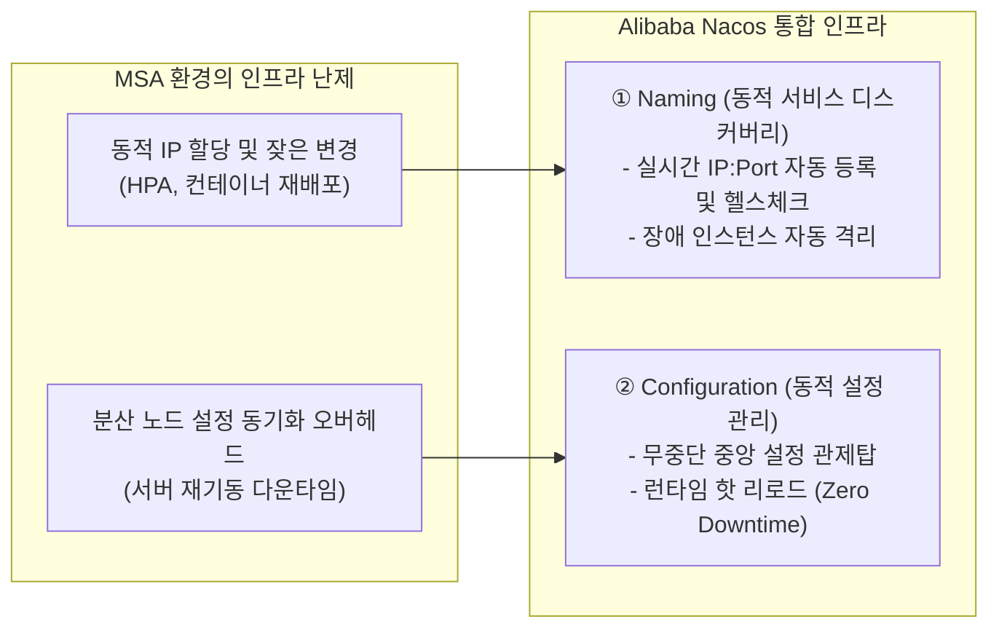
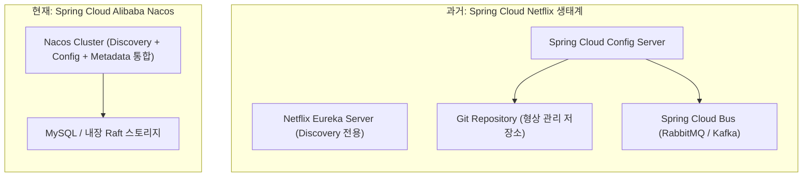
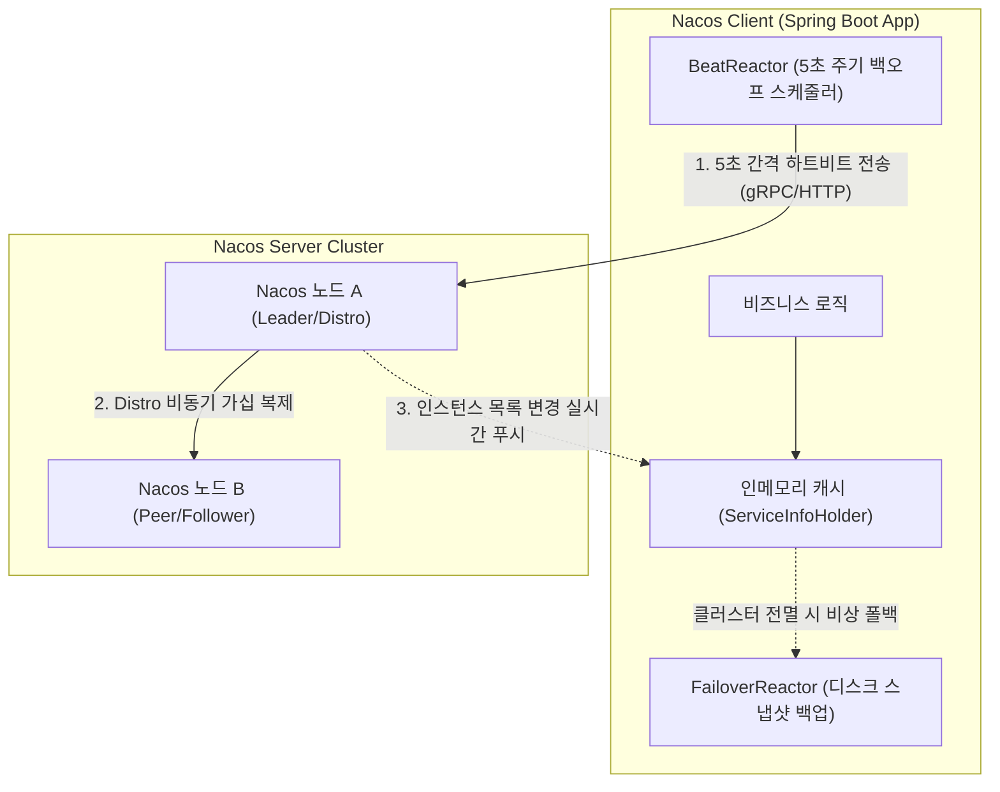
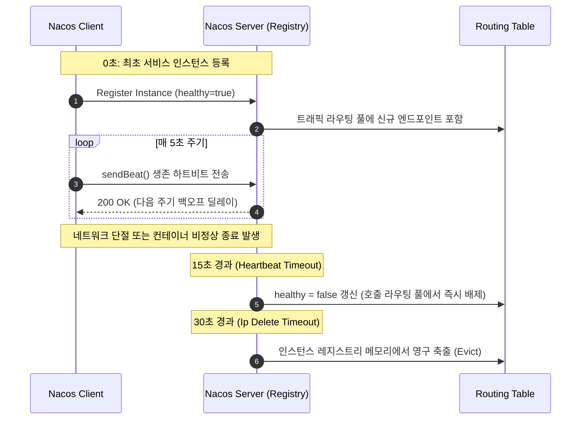
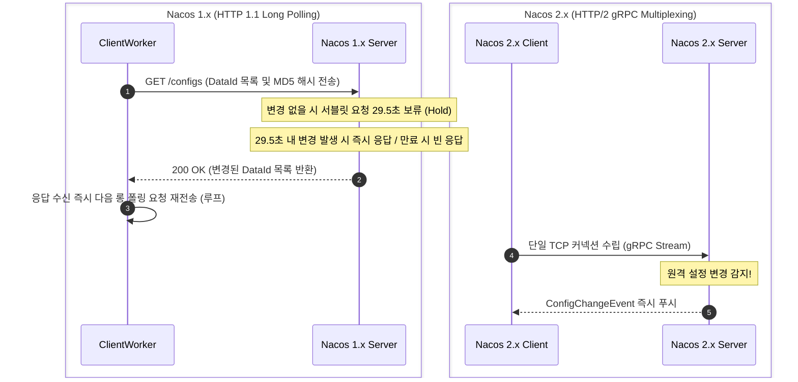
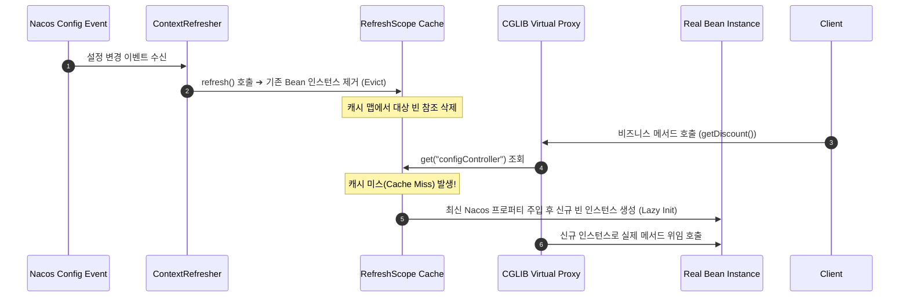
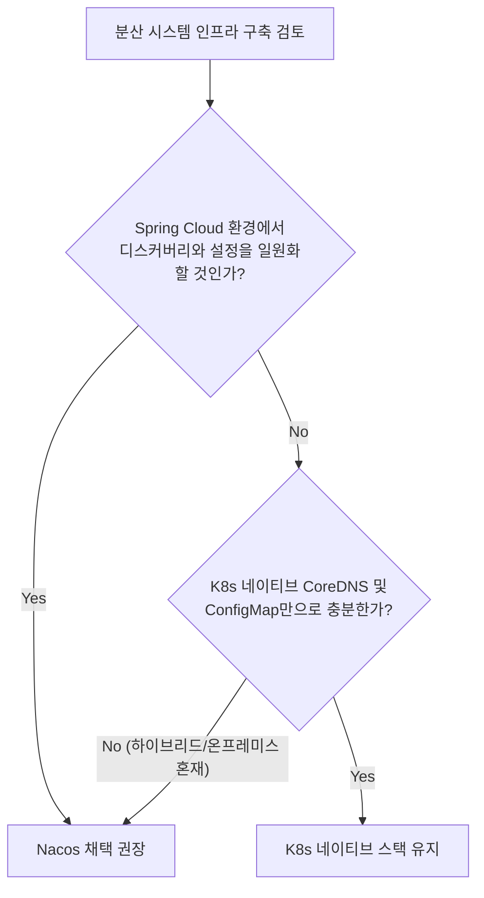

> 마이크로서비스 아키텍처(MSA)를 지탱하는 핵심 인프라인 Nacos의 내부 구조와 서비스 디스커버리, 동적 설정 동기화 메커니즘을 심층 분석한다.

---

## 1. Nacos 개념과 MSA의 과제

단일 서버에서 모든 기능이 동작하던 모놀리스(Monolith) 환경에서는 인프라 관리가 비교적 단순했다. 컴포넌트 간 호출은 JVM 인메모리 함수 호출로 처리되었고, 애플리케이션 설정은 배포 패키지 내 `application.properties` 하나로 충분했다.

그러나 수십, 수백 개의 독립된 서비스로 잘게 쪼개진 마이크로서비스 아키텍처(MSA)로 전환되면서, 분산 환경 특유의 거대한 인프라 난제에 직면하게 되었다.



### 1) 왜 서비스 디스커버리가 필요한가?
* **현실의 문제**: 클라우드와 컨테이너(Docker, Kubernetes) 환경에서 서비스 인스턴스들은 고정된 IP를 갖지 못한다. 트래픽에 따라 오토스케일링(HPA)으로 컨테이너가 수시로 증감하고, 노드 장애나 롤링 업데이트로 파드가 재시작될 때마다 **IP 주소가 무작위로 동적 할당**된다.
* **해결책**: 만약 호출자가 피호출자의 IP를 소스코드나 정적 설정 파일에 하드코딩해 두었다면, 상대방 컨테이너가 재부팅되는 즉시 연결이 끊기며 연쇄 장애가 발생한다. 따라서 모든 마이크로서비스의 최신 네트워크 위치를 실시간으로 추적해 주는 **'자동화된 실시간 전화번호부'**가 필수적이며, 이것이 바로 **서비스 디스커버리(Service Discovery)**다.

### 2) 왜 동적 구성 관리가 필요한가?
* **현실의 문제**: 50개의 서비스가 각각 3대씩 총 150개의 컨테이너로 기동 중인 대규모 분산 환경을 가정한다. 긴급 장애 격리를 위해 타임아웃 값을 3초에서 10초로 변경하거나 비즈니스 토글 플래그를 꺼야 할 때, 150개 컨테이너에 일일이 접속해 설정을 수정하고 프로세스를 재기동하는 것은 심각한 다운타임과 배포 리스크를 초래한다.
* **해결책**: 모든 분산 설정의 원천을 중앙 저장소에 일원화하고, 변경 발생 시 실행 중인 인스턴스에 즉각 이벤트를 브로드캐스트하여 **단 1초의 프로세스 재기동 없이 인메모리에 반영(Hot-Reload)하는 중앙 관제탑**이 요구된다. 이것이 바로 **동적 구성 관리(Dynamic Configuration)**다.

### 3) Nacos: Naming과 Config의 통합
Alibaba가 오픈소스로 공개한 **Nacos(Naming and Configuration Service)**는 이름 그대로 분산 아키텍처의 핵심 축인 **'Naming(서비스 디스커버리)'과 'Configuration(동적 설정)'을 단일 런타임 플랫폼으로 통합한 올인원 솔루션**이다.

---

## 2. Eureka 대비 아키텍처 강점

과거 Spring Cloud 생태계의 표준이었던 Netflix Eureka 기반 스택과 Nacos의 구조적 차이는 아키텍처 단순성에서 출발한다.



과거 넷플릭스 스택에서는 검색을 위해 Eureka를 띄우고, 설정을 위해 Config Server와 Git 레포지토리, 그리고 설정 갱신 이벤트 전파를 위한 메시지 브로커(Spring Cloud Bus + RabbitMQ/Kafka)까지 최소 3~4개의 독립 인프라 클러스터를 구축하고 유지보수해야 했다. 반면 Nacos는 단일 클러스터만으로 이 모든 기능을 완결한다.

> **💡 [다이어그램 포인트: Eureka가 홀로 떨어져 있는 이유]**  
> 위 다이어그램에서 Eureka(`E1`)와 Config 스택(`E2~E4`) 사이에 연결선이 없는 이유는 버그가 아니다. 과거 넷플릭스 스택에서는 서비스 검색 인프라와 설정 관리 인프라가 데이터나 통신을 전혀 공유하지 않고 완전히 분리되어 동작하던 '파편화된 고립 섬(Silo)'이었음을 보여주기 위한 의도된 표현이다. 클라이언트 애플리케이션은 이 두 개의 서로 다른 인프라에 각각 따로 접속해야 했다.

### 핵심 아키텍처 및 CAP 모델 비교

| 비교 항목 | Netflix Eureka | Alibaba Nacos |
|---|---|---|
| **기능 범위** | 서비스 디스커버리 전용 (단일 목적) | 서비스 디스커버리 + 동적 구성 관리(Config) 통합 |
| **일관성 모델 (CAP)** | **순수 AP 시스템** (가용성 극대화) | **AP + CP 하이브리드** (인스턴스별 유연한 선택 가능) |
| **통신 프로토콜** | HTTP 주기적 폴링 (기본 30초 주기) | UDP 푸시 (1.x) ➔ **gRPC 양방향 스트리밍 (2.x)** |
| **상태 전파 지연** | 최대 수십 초 (3단계 캐시 계층 경유) | **수 밀리초($ms$) 단위** 실시간 이벤트 스트리밍 |
| **인스턴스 유형** | 임시 인스턴스(Ephemeral)만 지원 | **임시(Ephemeral) / 영구(Persistent)** 모두 지원 |
| **오픈소스 생태계** | Eureka 2.x 오픈소스화 중단 (유지보수 모드) | Apache 2.0 라이선스 기반의 활발한 메인터넌스 |

Eureka가 분산 네트워크 단절 시에도 가용성을 위해 정합성을 양보하는 전형적인 **AP 시스템**이었다면, Nacos는 서비스 검색에는 AP 모델(Distro 프로토콜)을 취하면서도 강력한 일관성이 요구되는 데이터에는 **CP 모델(Raft 프로토콜)**을 선택할 수 있는 유연성을 제공한다.

---

## 3. 서비스 디스커버리 동작 원리

Nacos의 서비스 디스커버리는 활성 인스턴스의 헬스체크 상태를 실시간 수집하고, 장애 인스턴스를 라우팅 풀에서 즉각 배제하는 파이프라인으로 동작한다.



### 1) Distro(AP)와 Raft(CP) 하이브리드 합의
Nacos는 인스턴스의 생명주기 성격에 따라 서로 다른 분산 합의 알고리즘을 이원화하여 적용한다:

* **임시 인스턴스 (Ephemeral, `ephemeral=true`)**:
  * 컨테이너처럼 언제든 소멸하고 재생성될 수 있는 무상태 서비스에 적용된다 (기본값).
  * Alibaba가 독자 개발한 **Distro 프로토콜(AP)**을 사용한다. 노드 간에 마스터-슬레이브 종속이 없으며, 특정 노드에 등록된 인스턴스 데이터는 가십(Gossip) 메커니즘을 통해 피어 노드들에 비동기 복제된다. 노드 절반이 다운되더라도 서비스 등록과 검색은 중단되지 않는다.
* **영구 인스턴스 (Persistent, `ephemeral=false`)**:
  * 데이터베이스나 고정된 물리 서버처럼 상태가 보존되어야 하는 인스턴스에 적용된다.
  * 정족수(Quorum) 기반의 엄격한 일관성을 보장하는 **Raft 프로토콜(CP)**을 사용하여 상태를 영속 스토리지에 동기화한다.

### 2) 3단계 하트비트 생명주기 타임라인
임시 인스턴스는 클라이언트가 서버로 생존 신호를 능동적으로 전송하는 하트비트 메커니즘으로 생명주기를 갱신한다.



1. **5초 (Heartbeat Interval)**: 클라이언트의 `BeatReactor` 스레드가 5초마다 Nacos 서버로 `beat` 요청을 전송한다.
2. **15초 (Heartbeat Timeout)**: 서버가 15초 동안 하트비트를 받지 못하면 해당 인스턴스의 상태를 **`healthy = false`**로 변경한다. 게이트웨이 및 타 마이크로서비스는 이 시점부터 라우팅 대상에서 해당 인스턴스를 즉시 제외한다.
3. **30초 (Ip Delete Timeout)**: 30초 이상 무응답이 지속되면 인스턴스가 완전히 소멸한 것으로 판단하고 **레지스트리 메모리에서 인스턴스를 영구 삭제(Evict)**한다.

### 3) 3계층 클라이언트 캐시와 장애 격리
Nacos 클라이언트는 서버 클러스터 전체가 다운되는 극단적인 인프라 장애 상황에서도 서비스 간 통신이 마비되지 않도록 견고한 3계층 캐시 아키텍처를 보유한다.

1. **1차 힙 메모리 캐시 (`ServiceInfoHolder`)**: Nacos로부터 수신한 최신 인스턴스 목록을 `Map<String, ServiceInfo>` 형태로 JVM 힙에 상주시켜 $0ms$ 수준의 즉각적인 주소 조회를 보장한다.
2. **2차 로컬 디스크 스냅샷 (`FailoverReactor`)**: 인스턴스 목록이 갱신될 때마다 로컬 파일시스템(`${user.home}/nacos/naming/${namespace}/...`)에 백업 JSON 파일로 영속화한다. Nacos 서버 전원이 차단되더라도 클라이언트는 디스크 스냅샷을 읽어 정상 트래픽 라우팅을 유지한다.
3. **3차 실시간 이벤트 채널**: Nacos 1.x의 UDP 브로드캐스트와 Nacos 2.x의 gRPC 롱커넥션 스트림을 통해 토폴로지 변경 사항을 밀리초 단위로 수신한다.

---

## 4. 동적 설정 관리와 핫 리로드

Nacos Config의 핵심은 원격 저장소의 프로퍼티 변경을 감지하고, 실행 중인 애플리케이션의 컨텍스트를 무중단 리로드하는 과정에 있다.

### 1) HTTP 롱 폴링에서 gRPC 스트리밍으로의 진화



* **Nacos 1.x (HTTP 롱 폴링)**: 단순 주기적 폴링으로 인한 CPU 및 네트워크 낭비를 방지하기 위해 **29.5초 지연 응답(Long Polling Hold)** 메커니즘을 사용했다. 클라이언트는 설정 전문 대신 MD5 해시값만 전달하며, 서버는 변경 발생 시 즉각 응답하고 변경이 없으면 29.5초간 커넥션을 홀딩한 뒤 타임아웃을 반환했다.
* **Nacos 2.x (gRPC 양방향 스트리밍)**: 반복적인 HTTP 핸드셰이크 오버헤드를 완전히 제거하고, 단일 TCP 연결 기반의 **HTTP/2 gRPC 멀티플렉싱**을 채택했다. 설정이 변경되면 서버가 활성 스트림을 통해 이벤트를 즉시 푸시하므로, 전파 지연이 획기적으로 단축되고 초당 동시 처리 성능(TPS)이 대폭 향상되었다.

### 2) @RefreshScope와 CGLIB 가상 프록시 동작 원리
스프링 컨테이너에서 일반적인 싱글톤 빈은 기동 시점에 의존성과 프로퍼티가 고정된다. Spring Cloud Alibaba는 `@RefreshScope`를 통해 실행 중인 빈의 상태를 런타임에 동적으로 교체한다.



* `@RefreshScope`가 선언된 빈은 스프링 컨텍스트에 일반 싱글톤 객체로 등록되지 않고 **CGLIB 가상 프록시(Proxy)**로 감싸진다.
* Nacos 설정 변경 이벤트가 도달하면 `ContextRefresher.refresh()`가 실행되어 `RefreshScope` 내부 캐시 맵에서 해당 빈의 인스턴스를 제거(Evict)한다.
* 클라이언트의 다음 비즈니스 요청 인입 시 프록시 객체가 빈을 조회(`getBean`)하면, 캐시 미스가 발생하여 최신 환경 변수를 주입받은 **새로운 인스턴스가 즉석에서 생성(Lazy Initialization)**되어 주입된다.

---

## 5. 실무 연동 및 클라이언트 코드

실제 Spring Boot 프로젝트의 구성과 Nacos 클라이언트 내부의 핵심 소스코드를 구조적으로 분석한다.

### 1) Spring Boot 연동과 bootstrap.yml 바인딩

#### ① Maven 의존성 설정 (`pom.xml`)
```xml
<dependencies>
    <!-- Nacos 서비스 디스커버리 -->
    <dependency>
        <groupId>com.alibaba.cloud</groupId>
        <artifactId>spring-cloud-starter-alibaba-nacos-discovery</artifactId>
    </dependency>
    <!-- Nacos 동적 설정 관리 -->
    <dependency>
        <groupId>com.alibaba.cloud</groupId>
        <artifactId>spring-cloud-starter-alibaba-nacos-config</artifactId>
    </dependency>
</dependencies>
```

#### ② 부트스트랩 프로퍼티 (`bootstrap.yml`)
Spring Cloud 실행 생명주기상 Nacos Config는 기본 애플리케이션 컨텍스트 초기화 이전에 프로퍼티 소스로 로드되어야 하므로 `bootstrap.yml`에 선언한다.

```yaml
spring:
  application:
    name: order-service
  cloud:
    nacos:
      discovery:
        server-addr: 10.0.1.10:8848
      config:
        server-addr: 10.0.1.10:8848
        file-extension: yaml
        group: DEFAULT_GROUP
        namespace: production-namespace-id
```

Nacos 클라이언트는 자동으로 `${spring.application.name}.${file-extension}` 네이밍 컨벤션을 적용하여 **`order-service.yaml`**을 Data ID로 매핑하고 원격 설정을 끌어온다.

### 2) BeatReactor의 탄력적 백오프 스케줄링 분석
Nacos 클라이언트 내부에서 생존 신호를 전송하는 `BeatReactor`는 고정 주기 타이머가 아닌 서버 응답 기반의 탄력적 백오프 메커니즘으로 동작한다.

```java
// com.alibaba.nacos.client.naming.beat.BeatReactor.java (일부 발췌)
public class BeatReactor {
    private ScheduledExecutorService executorService;
    private final NamingProxy serverProxy;

    public void addBeatInfo(String serviceName, BeatInfo beatInfo) {
        // 첫 번째 하트비트 작업을 스케줄러에 등록
        executorService.schedule(new BeatTask(beatInfo), beatInfo.getPeriod(), TimeUnit.MILLISECONDS);
    }

    class BeatTask implements Runnable {
        BeatInfo beatInfo;

        public BeatTask(BeatInfo beatInfo) {
            this.beatInfo = beatInfo;
        }

        @Override
        public void run() {
            if (beatInfo.isStopped()) {
                return;
            }
            // 1. Nacos 서버로 생존 하트비트 전송
            long nextTime = serverProxy.sendBeat(beatInfo, BeatReactor.this.lightBeatEnabled);
            
            // 2. 서버가 응답 헤더로 전달한 다음 주기(nextTime)를 반영하여 스스로를 재귀 스케줄링
            executorService.schedule(new BeatTask(beatInfo), nextTime, TimeUnit.MILLISECONDS);
        }
    }
}
```

클라이언트가 무조건 5초 간격으로 요청을 난사하는 것이 아니라, **서버 부하 상태에 따라 응답으로 반환된 `nextTime` 지연값을 바탕으로 스스로를 재스케줄링**하는 백오프 보호 장치가 내장되어 있다.

### 3) ClientWorker의 2단계 롱 폴링 구현체 분석
Nacos 1.x의 `ClientWorker`는 대역폭 낭비를 억제하기 위해 해시 비교와 전문 다운로드를 분리한 2단계 롱 폴링 루프를 구동한다.

```java
// com.alibaba.nacos.client.config.impl.ClientWorker.java (일부 발췌)
public class ClientWorker {
    class LongPollingRunnable implements Runnable {
        @Override
        public void run() {
            List<CacheData> cacheDatas = getWatchedConfigs();
            
            // 1단계: 로컬 캐시에 등록된 모든 DataId의 MD5 해시 목록 직렬화
            String checkString = checkUpdateDataIds(cacheDatas);
            
            // 2단계: Nacos 서버로 29.5초 롱 폴링 요청 전송 (변경 키 조회)
            List<String> changedGroupKeys = checkUpdateConfigStr(checkString, isInitializingCacheList);
            
            // 3단계: 변경이 확인된 GroupKey에 대해서만 실제 설정 전문(Payload) 개별 다운로드
            for (String groupKey : changedGroupKeys) {
                String[] key = GroupKey.parseKey(groupKey);
                String content = getServerConfig(key[0], key[1], key[2], 3000L);
                
                CacheData cache = cacheMap.get(GroupKey.getKeyTenant(key[0], key[1], key[2]));
                cache.setContent(content); // 캐시 갱신 및 @RefreshScope 리스너 호출
            }
            
            // 4단계: 응답 처리 완료 즉시 다음 롱 폴링 루프 재실행
            executorService.execute(this);
        }
    }
}
```

모든 설정 텍스트를 지속적으로 동기화하지 않고, 수십 바이트 크기의 MD5 해시만 교환한 뒤 실제 변경이 식별된 키에 대해서만 지연 패치를 수행함으로써 네트워크 부하를 극소화했다.

---

## 6. Nacos 아키텍처 결론 및 요약



### 1) 엔지니어링 의사결정 매트릭스
* **Nacos 도입이 필수적인 경우**:
  * Spring Cloud 기반 MSA 환경에서 Eureka와 Spring Cloud Config의 이원화된 인프라 운영 오버헤드를 단일 플랫폼으로 통합하고자 할 때
  * 온프레미스 베어메탈 서버, VM, 이종 클라우드가 혼재되어 쿠버네티스 CoreDNS만으로는 통합 서비스 레지스트리 구축이 불가능한 하이브리드 환경
  * 결제 임계치, 로깅 레벨, 서킷 브레이커 설정 등을 파드 재배포 없이 수 밀리초 단위로 안전하게 핫 리로드해야 할 때

### 2) 핵심 요약 및 교훈
1. **플랫폼 통합성**: Nacos는 **서비스 디스커버리(Naming)**와 **동적 구성 관리(Configuration)**를 단일 런타임으로 일원화하여 분산 인프라 운영 복잡도를 대폭 낮춘다.
2. **하이브리드 일관성**: 컨테이너 기반 무상태 서비스에는 **Distro(AP)**를 적용하여 가용성을 보장하고, 영구 메타데이터에는 **Raft(CP)**를 적용하여 엄격한 정합성을 유지한다.
3. **단계적 하트비트 정책**: **5초(생존 신호) ➔ 15초(비정상 격리) ➔ 30초(영구 축출)**로 이어지는 엄격한 라이프사이클을 통해 장애 인스턴스로의 트래픽 유입을 실시간 차단한다.
4. **프로토콜 현대화**: HTTP 롱 폴링에서 **gRPC 양방향 멀티플렉싱 스트리밍**으로 전환함으로써 네트워크 대역폭 절약과 제로 지연에 준하는 설정 전파를 달성했다.
5. **투명한 핫 리로드**: 스프링 프레임워크와의 연동에서 **`@RefreshScope`**의 CGLIB 가상 프록시 및 동적 캐시 무효화 메커니즘을 활용하여, 무중단 상태 변경의 안정성을 보장한다.
