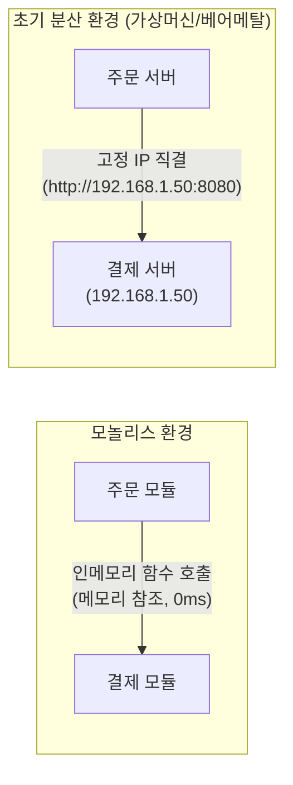
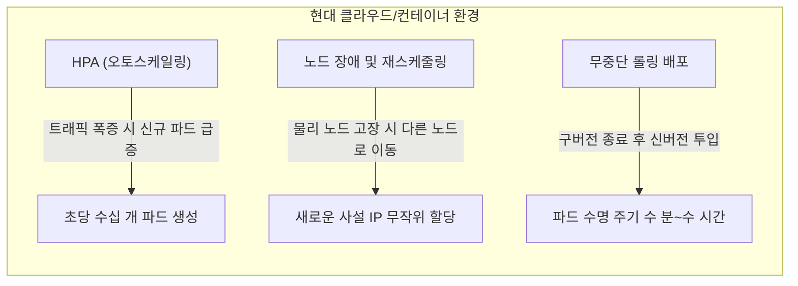
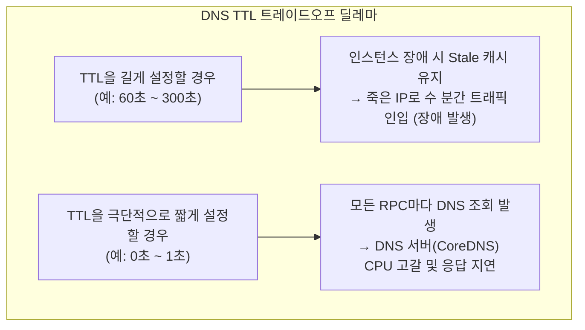
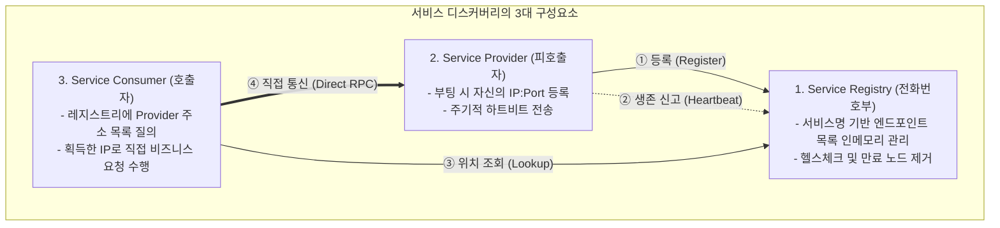
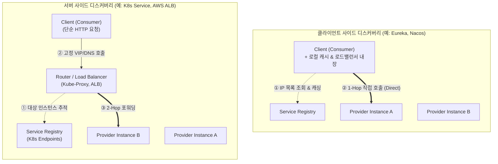
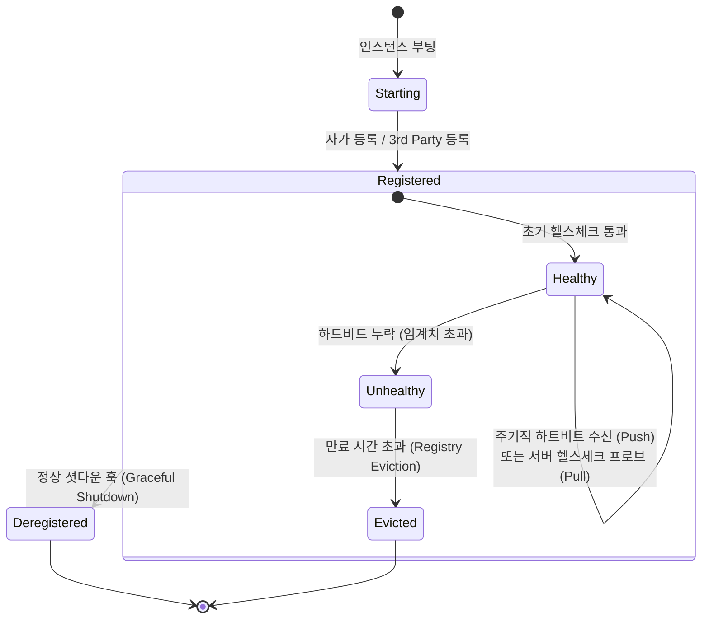
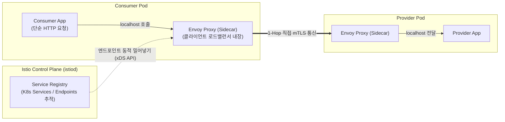

> 마이크로서비스 아키텍처(MSA)의 핵심 인프라인 서비스 디스커버리의 등장 배경, 전통 네트워크 도구의 한계, 클라이언트/서버 사이드 패턴 및 생명주기 메커니즘을 제1원칙 관점에서 심층 분석한다.

---

## 1. 모놀리스에서 클라우드 진화

컴포넌트 간 통신 메커니즘의 물리적 변화는 아키텍처의 패러다임을 완전히 바꾸어 놓았다.

단일 프로세스로 모든 비즈니스 로직이 기동되던 모놀리스(Monolith) 환경에서는 컴포넌트 간의 통신이 가장 단순하고 안정적인 형태로 이루어졌다. 한 클래스가 다른 서비스의 기능을 호출할 때, 이는 JVM 힙 메모리 상의 메모리 주소를 참조하는 직접 함수 호출(`userService.findUserById(id)`)에 불과했다. 컴파일러와 링커, 그리고 OS의 가상 메모리 관리자가 주소 바인딩을 완벽하게 보장했기 때문에 네트워크 레이턴시나 대상의 주소 유실은 고려 대상이 아니었다.



시스템이 물리적으로 분리된 초기 분산 환경(베어메탈 및 고정 가상머신)에서도 주소 해결은 여전히 정적인 방식으로 관리될 수 있었다. 서버 대수가 수 대에서 수십 대 수준이었고, 서버 한 대를 프로비저닝하고 IP를 할당받는 데 수 시간에서 수일이 걸렸기 때문이다. 엔지니어는 각 서버의 고정 IP를 `application.yml`이나 정적 프로퍼티 파일에 하드코딩해 두는 것만으로도 서비스를 안정적으로 운영할 수 있었다.

그러나 클라우드 인프라와 컨테이너 가상화(Docker, Kubernetes)의 등장은 이러한 전제를 무효화했다.



현대 MSA 환경에서 서버 인스턴스는 더 이상 영속적인 물리 자산이 아닌, 필요에 따라 언제든 죽고 재생성되는 소모품(Cattle, not Pets)이다. 
1. **잦은 스케일 아웃/인**: 트래픽 부하에 따라 Horizontal Pod Autoscaler(HPA)가 파드를 수시로 증감시킨다.
2. **동적 사설 IP 할당**: 파드가 재기동되거나 다른 워커 노드로 스케줄링될 때마다 네트워크 인터페이스에는 무작위 가상 IP(e.g., `10.244.3.52`)가 할당된다.
3. **짧아진 인스턴스 수명**: 배포 주기가 빨라지면서 하루에도 수십 번씩 인스턴스가 생성되고 파괴된다.

이러한 환경에서 호출할 대상의 IP를 정적 설정 파일에 기록해 두는 것은 서비스 불능을 의미한다. 상대방 파드가 재시작되는 순간 기존 IP는 블랙홀이 되고, 클라이언트는 타임아웃과 연결 거부 에러에 직면하게 된다.

---

## 2. 전통 DNS와 L4/L7의 한계

기존 인터넷을 지탱해 온 도메인 네임 시스템(DNS)과 하드웨어 로드밸런서(L4/L7)는 동적 컨테이너 환경의 주소 문제를 해결하기에 구조적 한계를 안고 있다.

새로운 인프라 컴포넌트를 도입하기 전에 항상 던져야 하는 질문이 있다. *"이미 전 세계 인터넷의 주소를 해결하고 있는 DNS나, 엔터프라이즈 환경에서 검증된 L4/L7 스위치를 내부 통신에 그대로 사용하면 안 되는가?"* 결론부터 말하자면, 두 기술 모두 동적으로 요동치는 마이크로서비스 내부(East-West) 통신 환경을 감당하도록 설계되지 않았다.

### 1) DNS TTL의 근본적 딜레마
DNS는 도메인 이름(`api.example.com`)을 IP 주소로 매핑해 주는 전 세계적인 분산 디렉터리 시스템이다. 그러나 DNS에는 캐싱을 제어하는 **TTL(Time-To-Live)**이라는 양날의 검이 존재한다.



* **TTL이 길 때 (Stale Data)**: 특정 컨테이너가 예기치 않게 종료(Crash)되었을 때, 클라이언트는 로컬 DNS 캐시에 남아 있는 만료 전 IP로 계속 요청을 보낸다. 트래픽은 블랙홀로 사라지고 대규모 서비스 장애로 이어진다.
* **TTL이 짧을 때 (Server Overload)**: 지연을 방지하기 위해 TTL을 0이나 1초로 극단적으로 낮추면, 수천 개의 마이크로서비스 인스턴스가 API를 호출할 때마다 네임서버로 DNS 질의를 날린다. 이는 내부 DNS 서버(e.g., K8s의 CoreDNS)에 부하를 폭증시켜 네임서버 자체를 마비시킨다.

### 2) JVM DNS 캐싱의 함정
자바 기반 백엔드(Spring Boot 등) 환경에서는 언어 런타임 차원의 추가적인 문제가 발생한다. JVM은 보안 및 성능상의 이유로 한 번 조회한 DNS 응답을 자체 메모리에 별도로 캐싱한다.
* 과거 JVM의 기본 보안 정책(`java.security`)에서 `networkaddress.cache.ttl`의 기본값은 보안 관리자가 설정되어 있을 경우 **무한(-1)**으로 설정되어 있었다.
* 보안 관리자가 없더라도 기본값이 수십 초 이상으로 고정되는 경우가 많아, 상위 DNS 서버가 레코드를 갱신하더라도 실행 중인 자바 애플리케이션은 이를 즉각 인지하지 못하고 과거의 IP로 요청을 고집한다.

### 3) 내부 통신(East-West)에서의 L4/L7 한계
전통적인 L4/L7 로드밸런서(F5, NetScaler, AWS ALB/NLB)를 서비스 간 호출마다 배치하는 방식 역시 한계가 명확하다.

| 비교 항목 | 외부 유입 트래픽 (North-South) | 서비스 간 내부 통신 (East-West) |
| :--- | :--- | :--- |
| **트래픽 비중** | 전체 트래픽의 약 10~20% | 전체 트래픽의 약 **80~90%** |
| **L4/L7 적용 시 문제** | 최전방 단일 진입점으로 적합함 | 모든 홉마다 프록시를 거치며 **네트워크 레이턴시 누적(+1 Hop)** |
| **비용 및 리소스** | 게이트웨이 장비 몇 대로 통제 가능 | 서비스 수 증가에 따라 장비 증설 비용 및 처리량 병목 급증 |
| **단일 장애점 (SPOF)** | 고가용성(HA) 구성으로 방어 | 중앙 로드밸런서 장애 시 사내 모든 마이크로서비스 간 통신 완전 마비 |

외부에서 유입되는 트래픽은 하드웨어 로드밸런서로 안전하게 제어할 수 있지만, 수백 개의 마이크로서비스가 초당 수만 번씩 주고받는 내부 통신을 중앙 로드밸런서로 통과시키는 것은 비용, 지연 시간, 장애 격리 측면에서 지속 불가능하다.

---

## 3. 서비스 디스커버리 핵심 개념

서비스 디스커버리는 애플리케이션 수준에서 실시간으로 갱신되는 동적 인메모리 전화번호부를 기반으로 작동한다.

앞서 살펴본 DNS의 캐싱 한계와 L4/L7의 병목을 극복하기 위해 등장한 패러다임이 바로 **서비스 디스커버리(Service Discovery)**다. 서비스 디스커버리는 복잡한 하드웨어 스위치나 정적 설정 없이, 소프트웨어 수준에서 인스턴스의 위치를 실시간으로 등록하고 추적하는 관제탑 역할을 수행한다.



### 1) 서비스 레지스트리 (Service Registry)
서비스 디스커버리의 심장은 **서비스 레지스트리(Service Registry)**라는 고가용성 데이터베이스다. 레지스트리는 본질적으로 단순하면서도 강력한 Key-Value 구조를 유지한다.

```text
Key: "order-service"
Value: [
  { "ip": "10.244.1.20", "port": 8080, "weight": 100, "healthy": true, "zone": "ap-northeast-2a" },
  { "ip": "10.244.2.45", "port": 8080, "weight": 100, "healthy": true, "zone": "ap-northeast-2b" },
  { "ip": "10.244.3.12", "port": 8080, "weight": 50,  "healthy": false, "zone": "ap-northeast-2c" }
]
```
* **서비스 논리명(Service Name)**을 식별자로 사용한다.
* 해당 서비스 논리명 아래 현재 정상적으로 살아 있는 **물리 인스턴스들의 배열(IP, Port, 가중치, 가용영역 메타데이터 등)**을 매핑한다.

### 2) 제어 평면(Control Plane)과 데이터 평면(Data Plane)의 분리
서비스 디스커버리 아키텍처가 뛰어난 성능을 보장하는 비결은 **위치 정보를 묻는 제어 통신(Control Plane)**과 **실제 비즈니스 페이로드를 실어 나르는 데이터 통신(Data Plane)**을 엄격하게 분리했기 때문이다.
* **제어 평면**: Consumer는 Provider의 위치가 필요할 때 레지스트리에 접속해 IP 목록만 받아온다(Look-up).
* **데이터 평면**: 실제 주문, 결제 등의 대용량 HTTP/gRPC 트래픽은 레지스트리를 거치지 않고, Consumer가 Provider의 IP로 **직접 점대점(Peer-to-Peer, 1-Hop) 통신**을 수행한다.
* 따라서 레지스트리 서버에 병목이 생기지 않으며, 레지스트리가 잠시 순저장애를 겪더라도 클라이언트는 이미 조회한 로컬 주소 정보로 정상 통신을 유지할 수 있다.

---

## 4. 클라이언트 대 서버 사이드

서비스 디스커버리를 구현하는 방식은 주소 탐색과 부하 분산의 책임을 '호출하는 쪽'에 두느냐, '중간 인프라'에 두느냐에 따라 나뉜다.

서비스 디스커버리 패턴은 위치 해석의 주체와 로드밸런싱 위치에 따라 크게 **클라이언트 사이드 디스커버리(Client-Side Discovery)**와 **서버 사이드 디스커버리(Server-Side Discovery)**의 두 가지 흐름으로 양분된다.



### 1) 클라이언트 사이드 디스커버리 (Client-Side Discovery)
Netflix Eureka, Alibaba Nacos, Spring Cloud LoadBalancer(과거 Ribbon) 등이 채택한 대표적인 방식이다.

* **동작 방식**: 
  1. 클라이언트(Consumer)는 애플리케이션 시작 시 레지스트리 서버로부터 타깃 서비스의 인스턴스 전체 목록을 가져와 로컬 메모리에 캐싱한다.
  2. 이후 비즈니스 요청이 발생하면, 클라이언트 내부에 내장된 로드밸런서 알고리즘(Round-Robin, Weighted, Least Connections 등)이 캐시 목록 중 적절한 인스턴스를 하나 선택한다.
  3. 클라이언트는 선택된 IP:Port로 중간 매개체 없이 직접 통신(1-Hop)한다.
* **장점**:
  * **극도의 짧은 지연 시간(Low Latency)**: 중간 프록시를 거치지 않고 직접 통신하므로 네트워크 홉이 추가되지 않는다.
  * **정교한 지능형 라우팅**: 클라이언트 코드 수준에서 가용영역(Zone Aware), 카나리 배포(Canary), 사용자 헤더 기반의 세밀한 트래픽 분기가 가능하다.
* **단점**:
  * **두꺼운 언어 종속적 SDK**: 클라이언트가 레지스트리 통신 규약과 로드밸런싱 알고리즘을 코드로 품어야 한다. Java/Spring Cloud 환경에서는 편리하지만, Node.js, Go, Python 등 다양한 언어가 혼재된 폴리글랏(Polyglot) 환경에서는 각 언어별 라이브러리를 모두 개발하고 관리해야 하는 거대한 운영 부담이 발생한다.

### 2) 서버 사이드 디스커버리 (Server-Side Discovery)
Kubernetes의 Service(kube-proxy 및 CoreDNS)와 AWS ALB/NLB가 대표적으로 채택하는 방식이다.

* **동작 방식**:
  1. 클라이언트는 개별 인스턴스의 동적 IP를 알 필요가 없다. 대신 안정적인 고정 가상 IP(VIP)나 DNS 이름(e.g., `http://payment-service.default.svc.cluster.local`)으로 요청을 던진다.
  2. 네트워크 경로 중간에 위치한 로드밸런서(또는 커널 레벨의 iptables/IPVS)가 레지스트리(K8s Endpoints)를 참조하여 트래픽을 실제 살아 있는 컨테이너 중 하나로 포워딩(2-Hop)한다.
* **장점**:
  * **완벽한 언어 중립성(Polyglot Agnostic)**: 클라이언트 애플리케이션은 디스커버리 로직이 전혀 필요 없다. 표준 HTTP/REST 클라이언트만 있으면 어떤 프로그래밍 언어로 작성되었든 동일하게 호출할 수 있다.
* **단점**:
  * **프록시 오버헤드**: 중간에 로드밸런서 계층을 거치므로 추가적인 네트워크 레이턴시가 발생하며, 로드밸런서 인프라의 가용성과 용량 한계를 지속적으로 관리해야 한다.

---

> [!IMPORTANT]
> **실무 인사이트: 전파 지연(Propagation Lag)과 클라이언트 복원력의 필연적 결합**
> 
> *"서비스 레지스트리가 존재하면 클라이언트의 서비스 호출 실패는 완벽히 차단되는가?"*
> 
> 현실의 분산 시스템에서는 그렇지 않다. 서비스 디스커버리는 구조적으로 **'전파 지연(Propagation Lag)'**이라는 맹점을 가질 수밖에 없으며, 이 공백기 동안 호출자(Client)로 장애가 전파되어 연쇄 실패(Cascading Failure)가 발생하지 않도록 하려면 **재시도(Retry)**와 **서킷 브레이커(Circuit Breaker)**를 통한 자체 결함 격리가 필수적이다.
> 
> **1. 전파 지연과 연쇄 장애(Cascading Failure)**
> 결제 서비스 인스턴스 3대(`A: 10.0.0.1`, `B: 10.0.0.2`, `C: 10.0.0.3`)가 동작 중일 때, 주문 서비스의 로컬 캐시에는 세 주소가 모두 등록되어 있다.
> * **10:00:00 (인스턴스 비정상 종료)**: 결제 서버 `A`가 메모리 누수(OOM)로 예기치 않게 프로세스가 종료된다.
> * **10:00:00 ~ 10:00:30 (레지스트리의 지연)**: 레지스트리는 하트비트 타임아웃(통상 30초)이 경과하기 전까지 `A`의 비정상 종료를 즉시 감지하지 못한다.
> * **10:00:00 ~ 10:00:45 (클라이언트 캐시 불일치)**: 주문 서비스는 주기적 폴링(30초 간격)으로 목록을 갱신하므로, 최대 45초가 지난 뒤에야 갱신된 명부(`[B, C]`)를 전달받는다.
> 
> **이 45초의 공백 동안 발생하는 현상:**
> 주문 서비스로 초당 100건의 트래픽이 유입되면, 라운드로빈에 의해 초당 33건의 요청이 이미 종료된 인스턴스 `A`로 계속 전송된다. 클라이언트는 TCP 연결 타임아웃(예: 3초) 동안 응답을 기다리며 블로킹되고, 불과 수 초 만에 **주문 서비스의 톰캣 워커 스레드 풀(200개)이 완전히 고갈(Thread Starvation)**된다. 결국 결제 서버 한 대의 장애가 주문 서비스 전체를 마비시키는 **연쇄 장애(Cascading Failure)**로 확산된다.
> 
> **2. 클라이언트의 2단계 자체 결함 격리 메커니즘**
> 중앙 레지스트리의 상태 동기화가 완료되기 전까지, 클라이언트는 로컬 계층에서 결함 격리 메커니즘을 동작시켜야 한다.
> * **1단계 - 페일오버 재시도(Failover Retry)**: `A(10.0.0.1)` 호출이 연결 거부(`ConnectException`)되면, 클라이언트는 사용자에게 즉시 에러를 반환하는 대신 로컬 캐시에 남아 있는 정상 인스턴스 `B(10.0.0.2)`로 즉시 우회하여 재호출한다. 사용자는 에러를 겪지 않고 주문을 완료한다.
> * **2단계 - 서킷 브레이커(Circuit Breaker)**: 하지만 매 요청마다 `A`에 대한 연결 시도가 실패한 뒤 `B`로 우회하면 지연 시간과 스레드 자원 소모가 지속된다. 이때 클라이언트 메모리 내의 서킷 브레이커가 작동한다. 최근 호출 실패율이 임계치를 초과하면 회로를 **OPEN(차단)**으로 전환한다. 이제 `A`로 향하는 트래픽은 네트워크 연결 시도 없이 **0ms 만에 즉시 차단(Fail-Fast)**되고 다른 정상 노드로 우회된다. 스레드 블로킹 시간이 제거된다.
> 
> | 구분 | 중앙 서비스 레지스트리 | 클라이언트 복원력 (재시도 + 서킷 브레이커) |
> | :--- | :--- | :--- |
> | **처리 수준** | 레지스트리 레벨의 **"엔드포인트 영구 말소"** | 호출자 레벨의 **"즉각적 결함 격리(Fail-Fast)"** |
> | **반영 속도** | **수십 초 단위 (주기적 동기화 지연)** | **즉각적 (1초 내 감지 및 0ms 즉시 차단)** |
> | **존재 목적** | 전체 시스템의 장기적 물리 위치 동기화 | **레지스트리 갱신 지연 시간 동안 호출 측 스레드 풀 고갈 방지** |
> 
> 즉, 서비스 디스커버리는 태생적으로 전파 지연을 가질 수밖에 없으며, **"레지스트리가 전체 위치를 동기화하는 동안, 클라이언트는 재시도와 서킷 브레이커로 즉각적인 연쇄 장애를 차단한다"**는 점에서 두 기술은 상호 보완적으로 동작해야 한다.

---

## 5. 레지스트리 내부 생명주기

인스턴스의 등록부터 생존 검증, 그리고 안전한 퇴출에 이르기까지 레지스트리는 엄격한 상태 전이 규칙을 따른다.

서비스 레지스트리가 수천 개의 동적 인스턴스 위치를 오차 없이 추적하기 위해서는 정교한 생명주기(Lifecycle) 관리 프로토콜이 필수적이다.



### 1) 등록(Registration): 자가 등록 vs 제3자 등록
* **자가 등록(Self-Registration)**: 인스턴스 프로세스가 직접 자신의 IP, 포트, 메타데이터를 파악하여 기동 시점에 레지스트리 REST/gRPC API를 호출해 자신을 등록한다(Spring Cloud Eureka/Nacos Client 방식). 구현이 직관적이지만 애플리케이션이 등록 라이브러리를 포함해야 한다.
* **제3자 등록(3rd Party Registration)**: 인스턴스 자체는 아무것도 하지 않는다. 외부의 독립된 오케스트레이터 에이전트(예: Kubernetes Kubelet, Docker Registrator)가 컨테이너의 생성과 종료 이벤트를 감지하여 레지스트리에 대신 등록하고 삭제한다.

### 2) 생존 검증(Health Check): Push vs Pull
등록된 인스턴스가 여전히 정상 동작 중인지 판별하는 방식도 두 갈래로 나뉜다.
* **클라이언트 푸시(Heartbeat)**: 인스턴스가 5초, 10초 주기로 레지스트리에 경량 헬스체크 패킷(Heartbeat Ping)을 지속적으로 전송한다(Eureka, Nacos 임시 인스턴스). 네트워크 부하가 분산되지만, 프로세스가 살아있더라도 내부 스레드풀 고갈이나 DB 커넥션 단절 등으로 실제 요청을 처리할 수 없는 비정상 상태를 신속히 감지하기 어려울 수 있다.
* **서버 풀(Probe)**: 레지스트리가 각 인스턴스의 헬스체크 엔드포인트(`GET /actuator/health`)로 HTTP/TCP 프로브 요청을 직접 전송한다(Consul, Kubernetes Liveness/Readiness Probe, Nacos 영구 인스턴스). 애플리케이션의 실제 서비스 가능 여부를 심층 검증할 수 있으나, 인스턴스 수가 많아질수록 레지스트리 측의 아웃바운드 트래픽 오버헤드가 증가한다.

### 3) 우아한 퇴출(Graceful Shutdown)과 비정상 축출(Eviction)
* **정상 종료(Graceful Deregistration)**: 애플리케이션이 `SIGTERM` 신호를 수신하면 종료 훅(Shutdown Hook, `@PreDestroy`)을 가동하여 레지스트리에 등록 해제(`deregister`) 요청을 보낸다. 레지스트리는 해당 인스턴스를 즉시 목록에서 제거하고 클라이언트들에게 알린다.
* **비정상 축출(Eviction)**: 노드 전원이 꺼지거나 네트워크 단절로 하트비트가 일정 시간(e.g., 30초) 동안 도달하지 않으면, 레지스트리의 백그라운드 퇴출 타이머가 작동하여 해당 인스턴스를 강제로 레지스트리에서 말소한다.

---

> [!NOTE]
> **심층 분석: CAP 정리와 서비스 레지스트리 (AP vs CP의 선택)**
> 
> 분산 시스템 설계의 정석인 **CAP 정리(Consistency, Availability, Partition tolerance)** 관점에서, 서비스 레지스트리는 어떤 결정을 내려야 하는가?
>
> 과거에는 데이터 일관성(C)을 보장하는 **CP 시스템(ZooKeeper, 초기 Consul의 Raft 클러스터)**을 레지스트리로 사용하는 경우가 많았다. 그러나 네트워크 파티션(P)이 발생하는 순간, 쿼럼(과반수)을 확보하지 못한 파티션의 노드들은 데이터 쓰기와 조회를 전면 중단(Freeze)해 버렸다. 결과적으로 레지스트리가 멈추면서 사내 모든 신규 인스턴스 배포와 오토스케일링이 연쇄적으로 올스톱되는 치명적인 장애가 발생했다.
>
> 현대의 서비스 디스커버리(Eureka, Nacos 임시 인스턴스)는 **AP(가용성 우선)**를 강력하게 지향한다:
> * **"잠깐 틀린 정보를 주더라도, 레지스트리는 절대 멈추지 않아야 한다."**
> * 레지스트리 간 동기화가 완벽하게 일치하지 않아 이미 종료된 인스턴스의 주소가 2~3초 더 남아있더라도, 레지스트리는 클라이언트의 조회 요청에 즉시 가용한 주소 목록을 반환해야 한다.
> * 잘못 전달된 주소로 인한 1회성 호출 에러는 앞서 설명한 클라이언트 사이드 **서킷 브레이커와 재시도(Retry)** 메커니즘으로 손쉽게 극복할 수 있기 때문이다.
> 
> *참고로 Nacos는 이러한 특성을 고려하여, 상태 없는 마이크로서비스 인스턴스는 고성능 비동기 합의 프로토콜인 **Distro(AP)**로 처리하고, 상태가 중요한 데이터베이스나 분산 설정은 **Raft(CP)**로 처리하도록 이중화 설계되어 있다.*

---

## 6. K8s와 디스커버리의 미래

Kubernetes가 인프라 표준이 된 현재, 서비스 디스커버리는 사이드카 기반의 서비스 메시(Service Mesh)로 진화하며 장점만을 흡수하고 있다.

현대 인프라의 사실상 표준(de-facto standard)인 Kubernetes는 자체적으로 완벽한 서비스 디스커버리 메커니즘(CoreDNS + K8s Service + kube-proxy)을 기본 내장하고 있다. 그렇다면 엔터프라이즈 환경에서는 왜 여전히 Nacos나 Eureka 같은 애플리케이션 레벨 레지스트리를 병행하거나, Istio 같은 새로운 기술로 넘어가는 것일까?

### 1) K8s Service 환경에서 Eureka/Nacos가 공존하는 이유
쿠버네티스의 내장 Service(kube-proxy)는 훌륭하지만, L4 수준(IP와 포트 기반)의 패킷 포워딩에 기초한다. 반면 고도화된 비즈니스 환경에서는 다음과 같은 애플리케이션 레벨의 제어가 필요하다.
1. **멀티 클러스터 및 하이브리드 클라우드 통신**: K8s 클러스터 내부의 파드와 기존 온프레미스 레거시 VM 서버 간에 동일한 서비스 논리명으로 통신해야 하는 경우, 단일 K8s 클러스터 범위를 넘어서는 전사적 레지스트리가 필요하다.
2. **풍부한 메타데이터 기반 라우팅**: HTTP 헤더, 사용자 등급(VIP vs 일반), 버전 메타데이터(`version=v2.1`)에 기반하여 특정 테넌트 트래픽만 카나리 인스턴스로 보내는 세밀한 트래픽 제어는 순수 K8s Service만으로는 구현하기 까다롭다.
3. **Spring Cloud 생태계와의 완벽한 일체감**: 기존에 구축된 Feign Client, Resilience4j, Spring Cloud Gateway 아키텍처를 K8s API 의존성 없이 코드 수준에서 유연하게 다룰 수 있다.

### 2) 서비스 메시(Service Mesh)로의 궁극적 진화
클라이언트 사이드와 서버 사이드 디스커버리 간의 트레이드오프는 **서비스 메시(Service Mesh, e.g. Istio + Envoy)** 아키텍처를 통해 보완되고 있다.



서비스 메시는 **"양쪽 패턴의 장점만을 취합"**하는 혁신적인 방식을 채택했다.
* **언어 독립성 확보 (서버 사이드의 장점)**: 애플리케이션 프로세스는 더 이상 거대한 SDK나 디스커버리 코드를 품지 않는다. 그저 로컬호스트(`localhost:8080`)의 사이드카 프록시(Envoy)로 평범한 HTTP 호출을 보낼 뿐이다.
* **1-Hop 직접 통신 및 지능형 라우팅 (클라이언트 사이드의 장점)**: 각 파드마다 붙어 있는 Envoy 사이드카 프록시가 컨트롤 플레인(istiod)으로부터 실시간 서비스 레지스트리 정보를 동기화받는다. 그리고 Envoy가 직접 목적지 파드의 Envoy로 **중간 중앙 로드밸런서 없이 1-Hop 직접 통신**을 수행한다.
* 또한 이 과정에서 서비스 간 상호 TLS(mTLS) 암호화와 트래픽 관찰성(Metrics, Distributed Tracing)까지 인프라 차원에서 완벽하게 해결된다.

---

## 7. 마치며: 핵심 요약과 통찰

모놀리스에서 분산 클라우드로의 여정에서 서비스 디스커버리는 단순한 편의 도구가 아니라 시스템의 생존을 위한 필수 통신 뼈대다.

| 진화 단계 | 주소 해결 주체 | 로드밸런싱 위치 | 장점 | 단점 / 극복 과제 |
| :--- | :--- | :--- | :--- | :--- |
| **모놀리스** | OS / 컴파일러 | 필요 없음 (단일 메모리) | 레이턴시 0ms, 단순함 | 수평 확장 한계, 단일 장애점 |
| **전통 DNS / L4** | DNS 서버, 중앙 L4/L7 | 중앙 하드웨어 스위치 | 표준 규격, 단순함 | TTL 딜레마, 2-Hop 지연, East-West 병목 |
| **클라이언트 사이드**<br/>(Eureka, Nacos) | 클라이언트 SDK | 클라이언트 애플리케이션 | 1-Hop 초고속, 지능형 라우팅 | 언어 종속 SDK 부담, 클라이언트 복잡도 |
| **서버 사이드**<br/>(K8s Service) | K8s CoreDNS / iptables | 커널 프록시 (kube-proxy) | 완벽한 언어 중립성 | 프록시 홉 오버헤드, 세밀한 L7 제어 한계 |
| **서비스 메시**<br/>(Istio / Envoy) | 컨트롤 플레인 (istiod) | 로컬 사이드카 (Envoy) | 언어 중립성 + 1-Hop 통신 + 보안 | 사이드카 컨테이너 자원 소비(CPU/Mem) |

서비스 디스커버리는 결국 **"동적으로 흩어지는 분산 노드들의 위치를 어떻게 가장 빠르고, 안정적이며, 투명하게 찾을 것인가?"**라는 질문에 대한 엔지니어링적 응답이다.

시스템의 규모, 사용하는 언어 환경, 인프라의 성숙도에 따라 최적의 해답은 달라질 수 있다. 중요한 것은 특정 툴의 사용법을 외우는 것이 아니라, DNS TTL의 딜레마, 제어 평면과 데이터 평면의 분리, CAP 정리 하에서의 가용성 선택 등 **기술 이면에 깔린 제1원칙의 트레이드오프**를 이해하고 현재 아키텍처에 가장 적합한 해답을 선택하는 것이다.
