> 평문 HTTP 통신은 추가적인 연산이나 왕복 지연이 없는 단순한 구조였다. 그러나 개방형 네트워크 환경에서 통신의 무결성과 기밀성을 보장하기 위해 전송 계층 보안(TLS)의 도입은 필연적이었다. 문제는 보안 계층이 개입하는 순간 **네트워크 왕복 지연(RTT) 증가와 CPU 연산 오버헤드라는 명확한 시스템 비용이 발생한다는 점**이다.  
> 본 글은 TLS/SSL의 기술 명세를 단순 나열하는 대신, 적대적인 네트워크 위에서 신뢰를 구축하면서도 그로 인해 발생하는 지연 시간과 연산 비용을 최소화하기 위해 엔지니어들이 고안해 온 **프로토콜 최적화와 공학적 트레이드오프의 발전사**를 심층 해부한다.

---

## 1. 웹 보안 위협과 HTTPS

평문 통신이 갖는 구조적 한계를 보완하기 위해 전송 계층 보안을 도입하는 과정에서 시스템은 물리적인 자원 한계와 마주하게 된다.

초기 웹 통신을 주도했던 표준 HTTP(HyperText Transfer Protocol)는 모든 메시지를 인코딩되지 않은 평문(Plaintext) 문자열로 전송했다. 이 설계는 프로토콜 처리에 따른 지연이나 CPU 연산 오버헤드가 없었으나, 개방형 공용망에서는 3대 보안 위협에 노출되는 치명적인 약점을 내포하고 있었다.

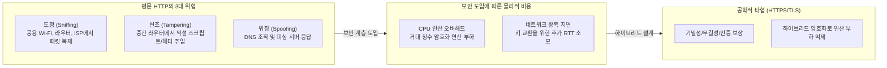

### 1) 평문 HTTP 통신의 3대 위협
1. **도청 (Eavesdropping / Packet Sniffing)**:
   - 전송 경로상의 스위치, 라우터, 게이트웨이를 통과하는 IP 패킷의 페이로드(쿠키, 세션 토큰, 패스워드, 개인정보)가 패킷 캡처 도구에 원본 그대로 노출된다.
2. **변조 (Data Tampering / Man-in-the-Middle)**:
   - 클라이언트와 서버 사이의 중계 노드가 패킷 페이로드를 임의로 수정하여 악성 스크립트를 삽입하거나, 응답 코드를 조작하여 캐시를 오염시킬 수 있다.
3. **위장 (Impersonation / Spoofing)**:
   - ARP 스푸핑이나 DNS 캐시 포이즈닝을 통해 사용자가 의도한 목적지 서버가 아닌 공격자의 서버로 트래픽을 유인하더라도 클라이언트는 상대방의 신원을 검증할 수 없다.

### 2) 계층적 위치: OSI 모델 속의 TLS
**HTTPS(HTTP over TLS)**는 독립된 별도의 전송 프로토콜이 아니다. 애플리케이션 계층(L7 HTTP)과 전송 계층(L4 TCP) 사이에 **TLS(Transport Layer Security)** 암호화 계층을 삽입하여 동작하는 복합 구조다.

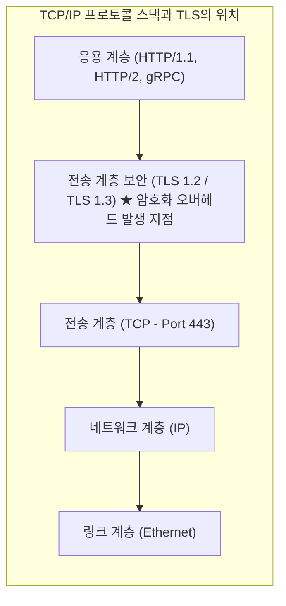

HTTP는 TLS를 하위 소켓 채널로 취급하여 평문 데이터를 전달하고, TLS가 이 데이터를 암호화하여 TCP 세그먼트로 하향 전달한다. 따라서 수신 측 TCP 계층에서 조립된 패킷은 TLS 모듈에서 복호화된 후에야 비로소 상위 HTTP 파서로 전달된다.

### 3) 대칭키와 비대칭키의 공학적 딜레마
암호화 채널을 구축할 때 엔지니어는 연산 속도와 키 분배 사이의 상반된 트레이드오프에 직면한다.

| 암호화 방식 | 주요 알고리즘 | 연산 속도 및 CPU 오버헤드 | 키 분배 및 관리 특성 |
| :--- | :--- | :--- | :--- |
| **대칭키 암호화**<br/>(Symmetric) | AES-128-GCM, AES-256-GCM, ChaCha20 | **초고속 (CPU 부하 극소)**<br/>CPU 하드웨어 가속(AES-NI)으로 마이크로초 단위 처리 | **키 배송 문제(Key Distribution Problem)**<br/>공용 인터넷을 통해 키를 안전하게 공유하기 어려움 |
| **비대칭키 암호화**<br/>(Asymmetric) | RSA-2048, ECDSA, ECDHE | **극저속 (CPU 부하 수백~수천 배)**<br/>거대 정수 멱승 및 타원곡선 스칼라 곱셈으로 고부하 유발 | **안전한 공개 가능**<br/>공개키(Public Key)는 공개하고 비밀키(Private Key)만 격리 |

- **대칭키의 한계**: 대용량 트래픽을 실시간 처리하기에 적합하지만, 사전에 상대방과 안전하게 키를 공유할 물리적 경로가 없다.
- **비대칭키의 한계**: 키 분배 문제는 해결되지만, 모든 HTTP 페이로드를 비대칭키로 처리하면 서버 CPU 자원이 빠르게 고갈되어 동시 처리량이 급감한다.

### 4) 하이브리드 암호 시스템(Hybrid Cryptosystem)
이 문제를 해결하기 위해 TLS는 두 암호화 방식의 장점만을 취하는 **하이브리드 암호 시스템(Hybrid Cryptosystem)**을 채택했다:

1. **핸드셰이크 단계(Handshake Phase)**: 계산 비용이 높지만 안전한 **비대칭키(공개키 / 디피-헬만)**를 초기 협상에만 사용하여, 양측 간에 단기 유효한 임시 대칭키(**세션 키, Session Key**)를 안전하게 합의한다.
2. **데이터 전송 단계(Record Phase)**: 세션 키 합의가 완료되면 비대칭키 연산을 종료하고, 이후 오가는 모든 대용량 HTTP 데이터는 CPU 하드웨어 가속(AES-NI)이 적용된 초고속 **대칭키(AES-GCM)**로 암호화하여 통신한다.

이 설계는 키 배송 문제를 해결하면서도, 데이터 전송 단계의 CPU 연산 오버헤드를 최소화하는 첫 번째 공학적 타협이다.

---

## 2. 암호학 원리와 키 교환

하이브리드 설계를 적용했더라도, 핸드셰이크 초기에 발생하는 비대칭키 연산 비용과 키 관리 취약점은 여전히 해결해야 할 과제였다.

### 1) 공개키 암호화의 두 가지 방향성
공개키(Public Key)와 비밀키(Private Key)는 수학적으로 결합된 쌍으로 동작하며, 적용 방향에 따라 서로 다른 보안 목적을 달성한다.

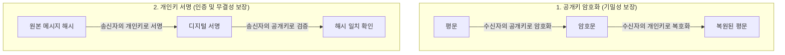

1. **수신자 공개키로 암호화 $\rightarrow$ 수신자 개인키로 복호화**:
   - 오직 개인키를 보유한 수신자만이 복호화할 수 있다. $\rightarrow$ **기밀성(Confidentiality)**
2. **송신자 개인키로 암호화(서명) $\rightarrow$ 송신자 공개키로 검증**:
   - 오직 송신자만이 서명을 생성할 수 있고, 누구나 공개키로 진위를 검증할 수 있다. $\rightarrow$ **인증(Authentication) 및 무결성(Integrity)**

### 2) RSA의 수학적 트랩도어와 연산량 한계
RSA는 **"두 소수의 곱셈은 쉬우나, 그 곱을 다시 소인수분해하는 것은 극도로 어렵다"**는 소인수분해 난제(Integer Factorization Problem)에 기반한 트랩도어 일방향 함수다.

#### 키 생성 및 수학적 구조
1. 두 개의 매우 큰 소수 $p, q$를 선택하여 모듈러스 $n = p \times q$를 계산한다.
2. 오일러 피 함수 $\phi(n) = (p - 1)(q - 1)$을 계산한다.
3. $\phi(n)$과 서로소인 공개 지수 $e$를 선택한다 ($e = 65537$).
4. $e \times d \equiv 1 \pmod{\phi(n)}$을 만족하는 개인 지수 $d$를 도출한다.
5. **공개키는 $(e, n)$**, **개인키는 $(d, n)$**이 된다.

- **암호화**: 평문 $m$에 대해 $c \equiv m^e \pmod n$ 계산
- **복호화**: 암호문 $c$에 대해 $m \equiv c^d \pmod n$ 계산

#### RSA의 공학적 한계
오일러의 정리에 따라 개인키 $d$를 알고 있으면 복호화($c^d \pmod n$)는 단순 계산으로 처리되지만, 공격자가 $n$을 소인수분해하여 $d$를 유도하는 것은 계산상 불가능에 가깝다.  
그러나 컴퓨팅 성능이 향상됨에 따라 보안 강도를 유지하기 위해 **RSA 키 길이는 1024비트에서 2048비트, 3072비트로 확장**되었다. 키 길이가 길어질수록 모듈러 멱승 연산의 복잡도가 가파르게 증가하여 **서버 CPU의 연산 부하가 가중**되었다.

더 큰 구조적 문제는 **정적 RSA 키 교환 방식의 순방향 비밀성(PFS) 결여**였다:
클라이언트가 대칭 세션키를 서버의 공개키로 암호화하여 전달하는 구조였기 때문에, 공격자가 암호화된 트래픽을 지속해서 수집해 두었다가 **추후 서버의 마스터 개인키를 확보하면 과거의 모든 통신 내용을 일괄 복호화할 수 있는 심각한 보안 취약점**이 존재했다.

### 3) 디피-헬만(Diffie-Hellman) 키 교환
엔지니어들은 데이터를 직접 암호화하여 전송하는 방식 대신, 양측이 **네트워크 상에 비밀키를 전송하지 않고도 동일한 비밀키를 독립적으로 합성**하는 **디피-헬만(Diffie-Hellman, DH)** 프로토콜을 도입했다.

이 알고리즘은 **이산대수 문제(Discrete Logarithm Problem)**에 기반한다:
$g^a \pmod p = A$를 계산하기는 쉽지만, 공개된 $A, g, p$로부터 지수 $a$를 역산하는 것은 현실적으로 불가능하다.

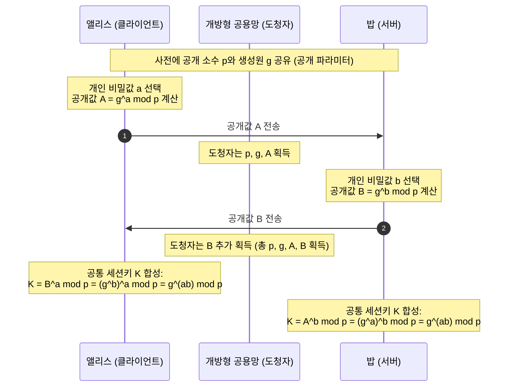

도청자가 전송 구간에서 $p, g, A(=g^a), B(=g^b)$를 모두 수집하더라도, $g^{ab} \pmod p$를 도출하려면 $a$나 $b$ 중 하나를 이산대수 역산으로 풀어내야 하므로 비밀키 $K$는 안전하게 보호된다.

### 4) 타원곡선(ECDHE)과 완전 순방향 비밀성(PFS)
하지만 기존 유한체 디피-헬만(DH) 역시 보안성을 갖추려면 2048비트 이상의 소수를 다루어야 하므로 연산 오버헤드가 여전히 컸다. 이를 타원곡선 대수로 개선한 방식이 **ECDHE(Elliptic Curve Diffie-Hellman Ephemeral)**다.

타원곡선($y^2 = x^3 + ax + b$) 상의 기준점 $G$에 스칼라 $d$를 곱하는 연산($Q = d \cdot G$)은 효율적이지만, $Q$와 $G$만으로 $d$를 찾는 것은 타원곡선 이산대수 난제(ECDLP)에 의해 계산상 불가능하다.  
**256비트 타원곡선(X25519, secp256r1)은 RSA 3072비트에 필적하는 보안 강도를 제공하면서도, 연산량과 패킷 크기를 크게 줄여 CPU 오버헤드를 낮췄다.**

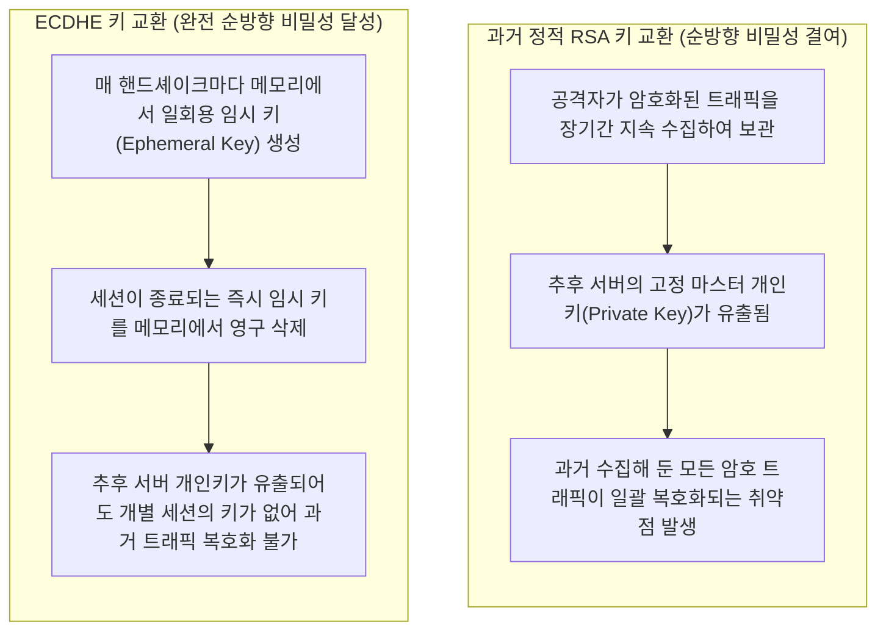

- **PFS(Perfect Forward Secrecy, 완전 순방향 비밀성)**:
  서버의 장기 개인키가 추후 유출되더라도, 과거 세션의 기밀성이 영구히 보장되는 성질.  
  매 핸드셰이크마다 일회용 임시 키(Ephemeral Key)를 생성하고 폐기하는 ECDHE가 표준으로 자리 잡으면서, 인터넷은 **연산 효율성 향상과 완전 순방향 비밀성 확보**를 동시에 달성했다.

---

## 3. PKI와 인증서 신뢰 체인

수학적 키 교환(ECDHE)은 도청을 방지했으나, 통신 대상이 신뢰할 수 있는 목적지 서버인지 증명하지 못했다. 이를 해결하기 위해 도입된 신원 검증 체계는 또 다른 네트워크 지연 문제를 수반했다.

### 1) 중간자 공격(MITM)의 위협
디피-헬만 키 교환의 구조적 한계는 상대방의 신원을 검증하지 않는다는 점이다. 중간 공격자가 통신 경로를 장악하고 양쪽과 각각 디피-헬만 키를 수립하면(Man-in-the-Middle), 양측은 암호화 통신을 수행하고 있다고 판단하지만 실제로는 중간자가 모든 통신을 복호화하여 확인할 수 있다.

따라서 공개키의 진위성을 신뢰할 수 있는 제3자가 보증하는 **공개키 기반 구조(PKI, Public Key Infrastructure)**가 필요하다.

### 2) X.509 디지털 인증서와 신뢰의 연쇄(Chain of Trust)
서버는 자신의 신원 정보(도메인)와 공개키를 표준 규격인 **X.509 인증서**에 담아 클라이언트에 제시한다.

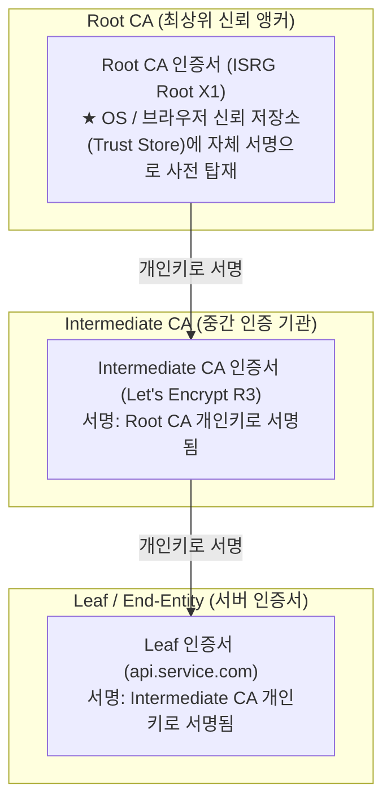

1. 클라이언트(브라우저 및 OS)는 신뢰할 수 있는 최상위 **루트 CA(Root CA)들의 인증서를 로컬 'Trust Store'에 사전 탑재**하여 관리한다.
2. 서버는 핸드셰이크 시 `Leaf 인증서`와 `Intermediate CA 인증서`를 묶은 인증서 체인을 전송한다.
3. 클라이언트는 Leaf 인증서의 해시값을 중간 인증서 공개키로 검증하고, 중간 인증서의 해시값을 최상위 Root CA 공개키로 역추적 검증한다.
4. 최상위 Root CA가 로컬 OS의 Trust Store에 존재하는 인증서임이 확인되면, 신뢰의 사슬(Chain of Trust)이 증명된다.

### 3) 신원 검증 지연의 해결: OCSP Stapling
인증서 체인을 통한 검증 외에도, **"해당 인증서가 유효기간 만료 전에 폐기(Revocation)되었는가?"**를 실시간으로 확인하는 과정에서 추가적인 네트워크 지연이 발생했다.

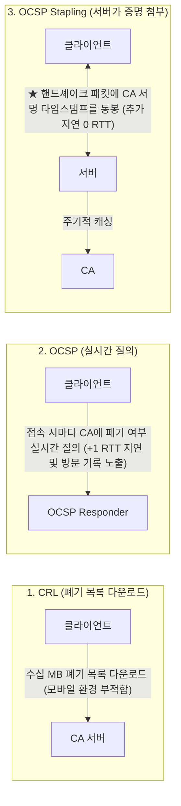

- **CRL (Certificate Revocation List)**: 폐기된 인증서 목록 전체를 다운로드하는 방식. 데이터 용량이 비대해져 모바일 환경에 적합하지 않았다.
- **OCSP (Online Certificate Status Protocol)**: 클라이언트가 사이트에 접속할 때마다 CA 서버에 폐기 여부를 실시간 조회하는 방식. **접속 시마다 추가로 +1 RTT의 네트워크 지연이 발생**했고, 사용자의 방문 기록이 CA에 노출되는 **프라이버시 이슈**가 존재했다.
- **공학적 개선: OCSP Stapling (RFC 6066)**:
  - 서버가 주기적으로 CA로부터 **인증서의 유효성을 증명하는 서명 및 타임스탬프가 포함된 OCSP 응답을 미리 발급받아 캐싱**한다.
  - 클라이언트가 접속하면, 서버는 TLS 핸드셰이크 패킷에 이 캐시된 응답을 함께 첨부(Staple)하여 전달한다.
  - 클라이언트는 외부 CA와 별도로 통신하지 않고 서버가 전달한 응답만으로 상태를 검증하므로, **인증서 유효성 확인에 따른 1 RTT 지연과 프라이버시 노출 문제를 해소**했다.

---

## 4. TLS 1.2와 1.3 핸드셰이크

암호학과 신원 검증 체계가 정립되었으나, 실제 네트워크 선로 위에서는 3 RTT에 달하는 초기 접속 지연이 주요 성능 병목으로 작용했다.

### 1) TLS 1.2의 병목: 3 RTT 초기 연결 지연
TLS 1.2(RFC 5246)는 안전한 암호화 채널을 수립하기 위해 TCP 3-Way Handshake 이후 **추가로 2 RTT(Round Trip Time)**의 네트워크 왕복 지연을 필요로 했다.

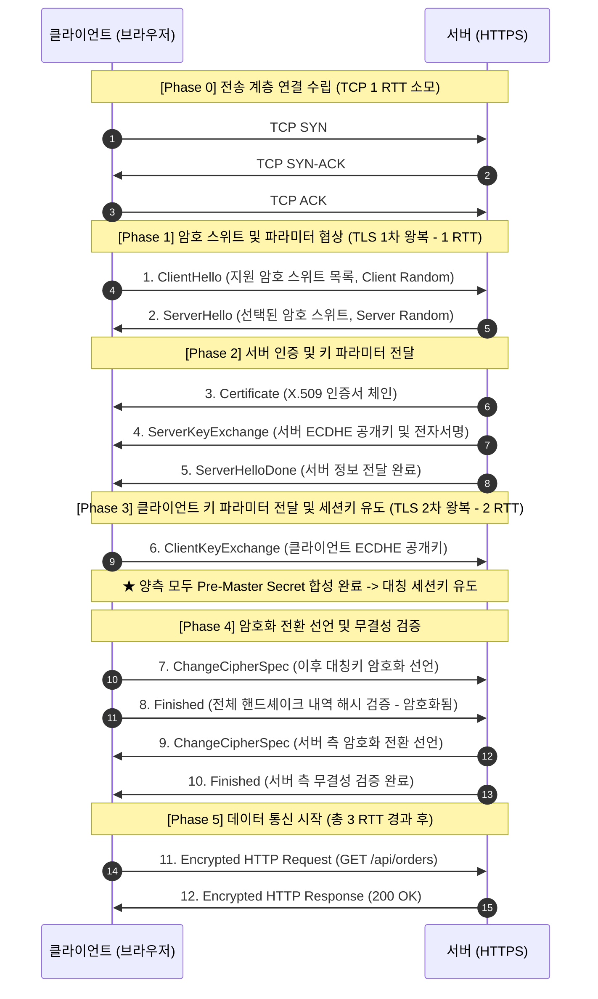

#### TLS 1.2 패킷별 1:1 상세 동작 메커니즘
1. **`ClientHello` (클라이언트 $\rightarrow$ 서버)**: 지원 가능한 암호 스위트 목록과 재전송 방지용 난수 `Client Random (32B)` 전달.
2. **`ServerHello` (서버 $\rightarrow$ 클라이언트)**: 최적 암호 스위트 1개 확정 및 `Server Random (32B)` 반환.
3. **`Certificate` (서버 $\rightarrow$ 클라이언트)**: 서버의 X.509 인증서 체인 전달.
4. **`ServerKeyExchange` (서버 $\rightarrow$ 클라이언트)**: 서버의 임시 타원곡선 공개점 $Q_s = d_s \cdot G$와 서버 개인키 전자서명 전달.
5. **`ServerHelloDone` (서버 $\rightarrow$ 클라이언트)**: 서버 측 초기 정보 전달 완료 선언.
6. **`ClientKeyExchange` (클라이언트 $\rightarrow$ 서버)**: 클라이언트 임시 공개점 $Q_c = d_c \cdot G$ 전달.
   - 양측은 $S = d_c \cdot Q_s = d_s \cdot Q_c$를 계산하여 네트워크 전송 없이 공유 비밀값(`Pre-Master Secret`) 도출.
   - PRF 함수에 `Pre-Master Secret + Client Random + Server Random`을 입력하여 실제 데이터 암호화에 쓸 대칭 세션키 도출.
7. **`ChangeCipherSpec` (클라이언트 $\rightarrow$ 서버)**: 대칭키 암호화 적용 시작 선언.
8. **`Finished` (클라이언트 $\rightarrow$ 서버)**: 전체 핸드셰이크 메시지의 해시값을 대칭키로 암호화하여 전달(무결성 최종 검증).
9. **`ChangeCipherSpec` / 10. `Finished` (서버 $\rightarrow$ 클라이언트)**: 서버 측 암호화 전환 선언 및 무결성 최종 검증 완결.

- **지연 시간 누적**: TCP에 1 RTT, TLS 1.2에 2 RTT가 소모되면서 **첫 번째 HTTP 요청을 전송하기까지 총 3 RTT의 지연이 발생**하여 모바일 등 고지연 네트워크 환경에서 뚜렷한 성능 병목이 되었다.

---

### 2) TLS 1.3의 설계 혁신: 1 RTT로의 단축
2018년 발표된 **TLS 1.3(RFC 8446)**은 핸드셰이크 지연 시간을 단축하고 보안성을 강화하기 위해 구조를 재설계했다.

#### 레거시 기능의 정리
- 순방향 비밀성(PFS)을 지원하지 않는 정적 RSA 키 교환 제거.
- 패딩 오라클 취약점이 있는 CBC 모드, RC4, 3DES, SHA-1 폐기.
- **오직 AEAD(AES-GCM, ChaCha20-Poly1305)와 ECDHE만 허용**.

---

### 3) TLS 1.3 1-RTT 핸드셰이크
암호 스위트 구성이 간소화되면서 클라이언트가 서버의 암호 알고리즘 선택을 사전에 예측할 수 있게 되었고, 이를 바탕으로 **핸드셰이크 지연을 1 RTT로 단축**했다.

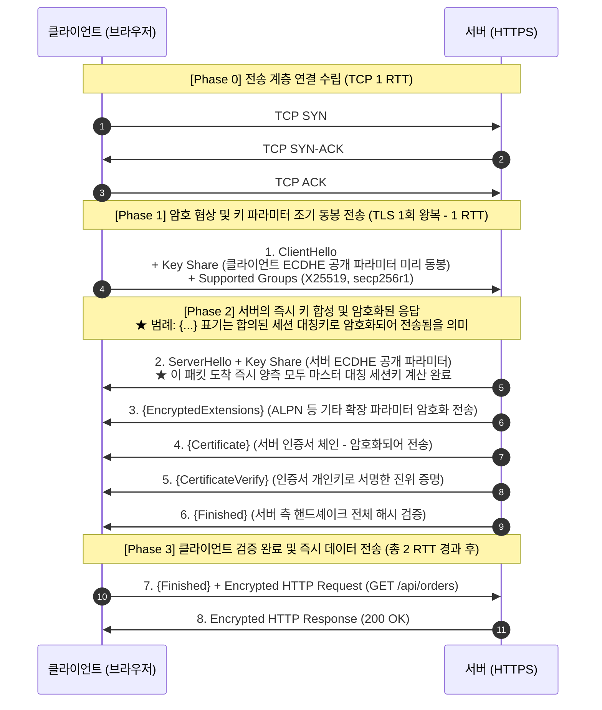

1. **`Key Share` 조기 전송**: 클라이언트는 서버의 응답을 기다리지 않고, **첫 패킷(`ClientHello`)에 자신의 타원곡선 공개키(`Key Share`)를 미리 포함**하여 발송한다.
2. **단 1회 왕복으로 세션키 도출**: 서버가 자신의 공개키(`Key Share`)를 반환하는 즉시 양측 모두 세션 대칭키 계산을 완료한다.
3. **`{...}` 중괄호 표기 (패킷 암호화)**: 2번 응답 직후부터 채널이 암호화되므로, **서버 인증서와 SNI 응답까지 패킷 감청으로부터 보호**된다.
4. **`CertificateVerify`의 역할**: 공개키 인증서(`Certificate`)와 달리, 서버가 해당 공개키에 대응하는 비밀키를 실제로 소유하고 있음을 증명하기 위해 핸드셰이크 내역 전체를 개인키로 서명한 데이터다.
5. **결과**: TCP 1 RTT + TLS 1.3 1 RTT = **총 2 RTT 만에 첫 HTTP 통신을 시작하여 초기 지연 시간을 33% 단축**했다.

---

### 4) 0-RTT 세션 재개와 재전송 공격 대응
TLS 1.3은 재방문 클라이언트를 대상으로 핸드셰이크 지연을 없애는 **0-RTT 세션 재개(0-RTT Session Resumption / Early Data)**를 지원한다.

#### (1) 정상적인 0-RTT 세션 재개 메커니즘
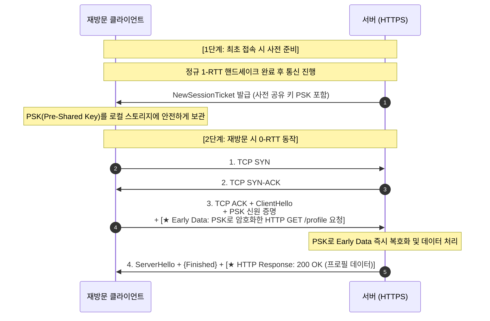

- 재방문 클라이언트는 TCP 연결 완료와 동시에 전송하는 `ClientHello` 패킷에 이전에 발급받은 **사전 공유 키(PSK)로 암호화한 HTTP 요청(Early Data)을 함께 포함**하여 전달한다.
- 서버는 첫 응답 패킷에 핸드셰이크 완료 신호와 함께 **HTTP 200 OK 응답 데이터를 동시에 포함하여 반환**함으로써, 초기 데이터 교환에 소요되는 지연 시간을 0 RTT로 줄인다.

#### (2) 0-RTT의 보안 취약점: 재전송 공격(Replay Attack)
0-RTT 방식은 실시간 임시 키 교환 과정을 생략하므로 암호학적 취약점이 발생할 수 있다.

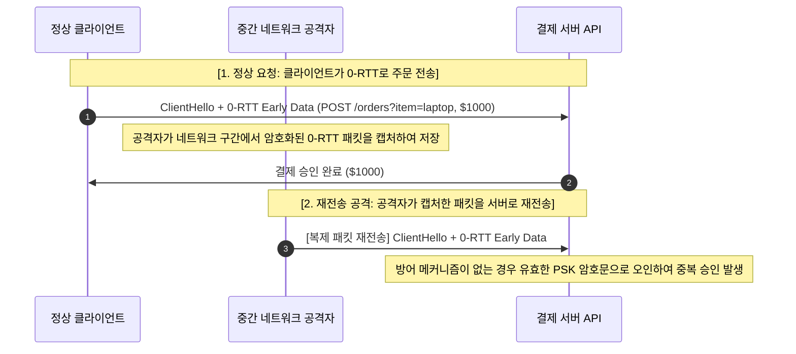

- **공학적 방어 규칙**:
  1. **멱등성(Idempotency) 준수**: 서버 상태를 변경하는 **비멱등 요청(`POST`, `PUT`, `DELETE` - 결제, 주문 등)에는 0-RTT 사용을 제한**하고, 조회 목적의 **멱등한 요청(`GET`)에만 허용**해야 한다.
  2. **Replay Window 필터링**: 프록시(Envoy, Nginx) 계층에서 수신된 0-RTT ClientHello 난수와 타임스탬프를 캐싱하여 중복 유입된 패킷을 식별하고 차단해야 한다.

---

## 5. 레코드 계층과 AEAD 전송

핸드셰이크 완료 후 실제 애플리케이션 데이터를 전송하는 레코드 계층에서도 연산 효율과 보안성을 높이기 위한 구조 개선이 이루어졌다.

### 1) TLS 레코드 프로토콜 구조
HTTP 데이터는 최대 16KB($2^{14}$ 바이트) 단위의 **레코드(Record)**로 분할(Fragmentation)되어 캡슐화된다.

```
+----------------+----------------+----------------+----------------+
|  Content Type  | Major Version  | Minor Version  |     Length     |
|    (1 Byte)    |    (1 Byte)    |    (1 Byte)    |    (2 Bytes)   |
+----------------+----------------+----------------+----------------+
|                                                                   |
|                 Encrypted Payload (AEAD Ciphertext)               |
|                                                                   |
+-------------------------------------------------------------------+
|                     Authentication Tag (16 Bytes)                 |
+-------------------------------------------------------------------+
```

- **Content Type (1B)**: 20(ChangeCipherSpec), 21(Alert), 22(Handshake), 23(Application Data).
- **Protocol Version (2B)**: 하위 호환성을 위해 `0x0303`(TLS 1.2 레거시 표기) 고정.
- **Length (2B)**: 암호화된 페이로드의 바이트 길이.

### 2) 기밀성과 무결성의 3대 결합 방식 (MtE, E&M, EtM)
데이터 전송 단계에서 기밀성(대칭 암호화 $E$)과 무결성(메시지 인증 $MAC$)을 결합할 때, 두 암호학적 원시 연산을 조합하는 순서와 구조에 따라 3가지 전통적 아키텍처가 존재한다.

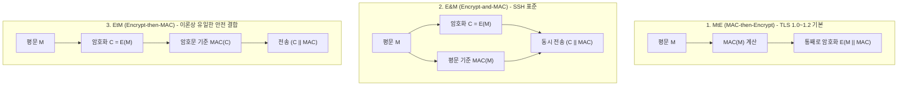

1. **MtE (MAC-then-Encrypt)**:
   - **메커니즘**: 평문에 MAC을 먼저 결합한 후, 전체를 CBC 블록 암호로 암호화한다.
   - **구조적 결함**: 수신 측은 MAC을 검증하기 위해 **암호문을 반드시 먼저 복호화**해야 한다. 이 과정에서 패딩(Padding) 오류와 MAC 불일치 오류 간의 서버 응답 시간 차이가 발생하며, 공격자는 이를 이용해 암호문을 바이트 단위로 복원하는 **패딩 오라클 공격(Padding Oracle, POODLE, Lucky Thirteen)**을 수행할 수 있다.
2. **E&M (Encrypt-and-MAC)**:
   - **메커니즘**: 평문을 대칭키로 암호화하는 동시에, 원본 평문을 입력값으로 MAC을 별도 계산하여 둘을 함께 전송한다(SSH 표준 채택).
   - **구조적 결함**: MAC이 '평문'을 기반으로 생성되므로, 결정론적 MAC인 경우 동일한 평문에 대해 동일한 태그가 출력된다. 도청자는 암호문을 해독하지 않고도 태그의 반복 패턴을 분석하여 평문의 통계적 정보를 유추할 수 있다.
3. **EtM (Encrypt-then-MAC) — 이론상 가장 안전한 결합**:
   - **메커니즘**: 평문을 먼저 암호화한 뒤, **생성된 암호문($C$)을 입력값으로 MAC을 계산**하여 전송한다.
   - **보안적 우수성**: 수신 측은 **복호화 연산을 수행하기 전에 암호문의 MAC 무결성을 먼저 검증**한다. 변조된 패킷은 복호화 루틴에 진입조차 하지 못하고 즉시 폐기되므로, 복호화 과정에서 발생하는 패딩 오라클 공격이 구조적으로 원천 차단된다. 암호학적으로 선택 암호문 공격에 대한 불인식성(IND-CCA2)이 입증된 유일한 결합 방식이다(TLS 1.2에서도 뒤늦게 RFC 7366 확장으로 채택됨).

### 3) 단일 파이프라인 AEAD(AES-GCM)로의 수렴 이유
이론상 EtM이 수학적으로 안전함에도 불구하고, TLS 1.3은 개별 알고리즘 조합 방식을 전면 폐기하고 **AEAD(Authenticated Encryption with Associated Data)**만을 표준 암호 제품군으로 단일화했다.

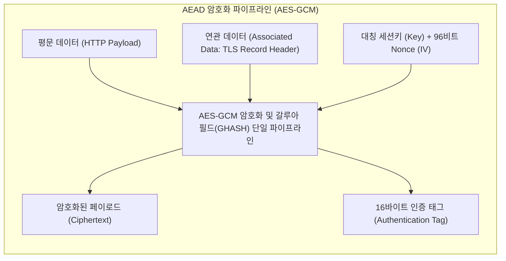

1. **수동 조합의 구현 위험 제거**:
   - 암호화 알고리즘($E$)과 MAC 알고리즘을 엔지니어가 수동으로 조합하도록 허용하면 키 파생 오류, 초기화 벡터(IV) 재사용, 사이드 채널 타이밍 취약점이 소프트웨어 구현마다 끊임없이 재발한다.
   - AEAD는 암호화와 무결성 인증을 개별 연산으로 분리하지 않고, **단 하나의 수학적 원시 연산(Cryptographic Primitive)**으로 통합하여 잘못된 조합 가능성을 사전에 차단한다.
2. **하드웨어 가속 단일 파이프라인**:
   - 별도의 해시 함수(HMAC-SHA256 등)를 거치지 않고, 갈루아 카운터 모드(GCM)의 GHASH 연산을 암호화 루프와 동시에 수행하여 16바이트 인증 태그(Auth Tag)를 산출한다.
   - CPU 전용 명령어(Intel AES-NI 및 PCLMULQDQ)를 통해 단일 파이프라인 하드웨어 가속이 동작하므로, 메모리 복사와 CPU 연산 오버헤드가 극소화된다.
3. **AAD(Associated Data) 무결성 보장**:
   - 패킷 라우팅과 처리를 위해 평문으로 노출되어야 하는 레코드 헤더(Type, Length, Version)는 암호화하지 않되, **인증 태그 계산 범위(Associated Data)에 포함**시킨다. 중간 노드가 헤더를 1비트라도 조작하면 수신 측의 단일 검증 단계에서 즉시 탐지되어 패킷이 폐기된다.

---

## 6. 인프라 최적화와 mTLS

분산 시스템 환경에서는 개별 애플리케이션 서버가 직접 암호화 연산을 모두 부담하지 않도록 인프라 계층에서 오버헤드를 분산 및 최적화한다.

### 1) L7 로드밸런서 SSL Termination의 역할
직전 글([L4 대 L7 로드밸런서의 원리와 아키텍처 해부](file:///C:/git/github-blog/src/content/posts/l4-l7-load-balancer-architecture.md))에서 다룬 **L7 SSL Termination(오프로딩)**은 암호화 연산 부하를 최전방 인프라 엣지로 격리하는 아키텍처 패턴이다:

- 다수의 외부 클라이언트로부터 유입되는 비대칭키 핸드셰이크와 대칭키 복호화 작업을 최전방 L7 프록시(ALB, Nginx, Envoy)에서 종단한다.
- 전용 하드웨어 가속 모듈(QAT, AWS Nitro)을 갖춘 엣지 계층이 트래픽을 복호화한 후, 내부 사설망의 백엔드 마이크로서비스로는 평문 HTTP 패킷을 포워딩한다.
- **백엔드 애플리케이션 서버는 암·복호화 연산 부담을 덜고 순수 비즈니스 로직 처리에 컴퓨팅 자원을 집중**할 수 있다.

### 2) 세션 재사용(Session Resumption): Session ID vs Ticket
매번 비대칭키 핸드셰이크를 반복하지 않도록 세션 상태를 캐싱하여 재사용한다.

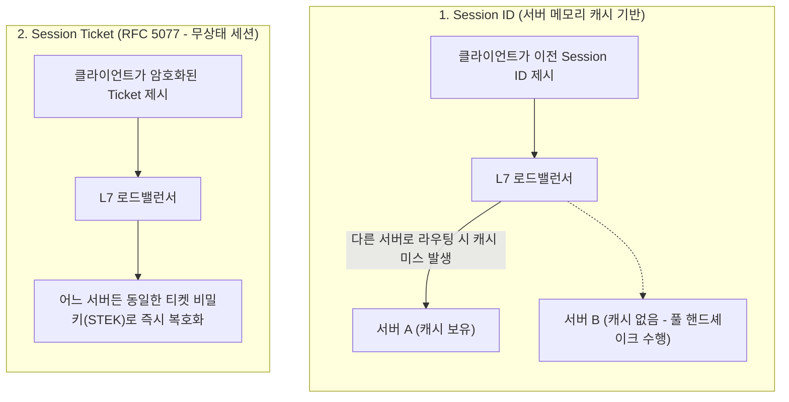

- **Session ID**: 서버 메모리에 상태를 저장하므로, 다중 인스턴스 환경에서 요청이 다른 서버로 분산될 경우 캐시 미스가 발생하여 전체 핸드셰이크를 다시 수행해야 한다.
- **Session Ticket (RFC 5077)**: 서버가 세션 상태를 자체 비밀키(STEK)로 암호화하여 클라이언트에 티켓 형태로 발급한다. 클라이언트가 재접속 시 이 티켓을 제시하면 어느 서버든 즉시 복호화하여 1 RTT 이하로 세션을 복원하는 **무상태(Stateless) 클러스터 아키텍처**를 구성할 수 있다.

### 3) ALPN(Application-Layer Protocol Negotiation)
HTTP/1.1에서 바이너리 멀티플렉싱 기반의 HTTP/2 및 QUIC 기반 HTTP/3로 진화하면서 프로토콜 협상이 필요해졌다.  
**ALPN(RFC 7301)**은 TLS 핸드셰이크 확장 필드(`ClientHello` / `EncryptedExtensions`)를 활용하여, **별도의 HTTP 프로토콜 업그레이드 왕복(1 RTT) 없이 핸드셰이크 완료 즉시 협상된 프로토콜로 통신을 개시**할 수 있도록 최적화했다.

### 4) mTLS(Mutual TLS)와 서비스 메시 Zero Trust
일반적인 웹 통신은 서버만 신원을 증명하는 단방향 인증을 사용한다. 그러나 내부 네트워크 침투 위협에 대비하는 클라우드 환경에서는 **상호 검증을 전제로 하는 Zero Trust 보안 모델**이 표준으로 자리 잡았다.

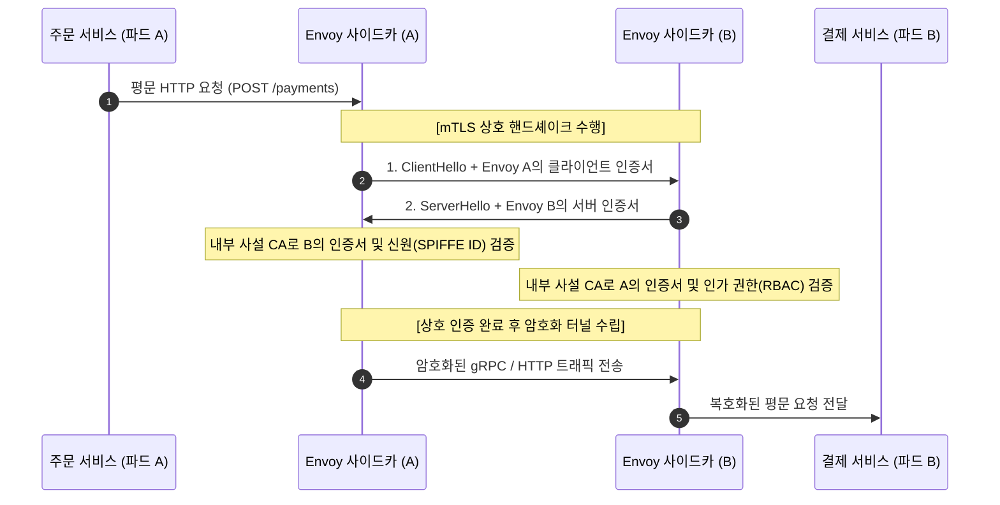

- **상호 인증 메커니즘**: 서버뿐만 아니라 클라이언트도 자신의 X.509 인증서를 제시하고 개인키 서명(`CertificateVerify`)을 검증받는다.
- **사이드카 프록시를 통한 자동화**: 쿠버네티스 파드에 주입된 Envoy 사이드카가 mTLS 암호화와 **SPIFFE ID(예: `spiffe://cluster.local/ns/prod/sa/order-service`)** 검증을 투명하게 대행함으로써, 애플리케이션 코드는 비즈니스 로직에 집중하면서도 서비스 간 상호 인증을 확립할 수 있다.