# [Train Ticket 완벽 정복 1편]

> **연재 순서**:  
> **▶ [제1편] 아키텍처 청사진 & 인프라 뼈대 (System Overview & ts-common)**  
> [제2편] 관문 & 신원 보증 (Gateway, Auth, Security)  
> [제3편] 철도망 & 스케줄링 (Travel, Train, Route, Planning)  
> [제4편] 좌석 배정 엔진 & 인프라 파사드 (Seat, Basic, Price)  
> [제5편] 예매 오케스트레이션 & 주문의 심장 (Preserve, Order, Wait-Order)  
> [제6편] 결제 & 핀테크 & 부가서비스 생태계 (Payment, Voucher, Food, Consign)  
> [제7편] 백오피스 운영망 (Admin Services 5종)  
> [제8편] 실전 배포, 부하 테스트, 그리고 MSA 설계 교훈 (Deployment, JMeter, Architecture Review)

---

## 1. 프롤로그: 왜 Train Ticket인가?

넷플릭스의 Eureka와 Spring Cloud, 쿠버네티스(Kubernetes)와 서비스 메시(Istio)가 엔터프라이즈의 표준으로 자리 잡았지만, 실제로 **수십 개의 마이크로서비스가 맞물려 돌아가는 초대형 실전 시스템**의 내부 코드를 투명하게 들여다볼 수 있는 기회는 흔치 않다. 대다수의 튜토리얼 예제는 2~3개의 토이 서비스 수준에 머물러 있어, 분산 트랜잭션, 데이터 동기화 지연, 폴리글랏 퍼시스턴스, 서비스 간 의존성 지옥(Dependency Hell) 같은 실제 MSA의 민낯을 체감하기 어렵다.

이러한 갈증을 완벽하게 해소해 주는 오픈소스 프로젝트가 바로 중국 푸단대학교(Fudan University) SELab/CodeWisdom 팀이 개발한 **Train Ticket**이다.

```text
  ┌────────────────────────────────────────────────────────────────────────┐
  │                           Train Ticket Benchmark                       │
  │  - 총 46개 마이크로서비스 (Java Spring Cloud, Go, Python, Node.js)        │
  │  - 총 26개 독립 데이터베이스 (MongoDB, MySQL)                           │
  │  - 전 세계 학계 및 빅테크 SRE/AIOps/분산추적/장애진단 연구의 표준 벤치마크      │
  └────────────────────────────────────────────────────────────────────────┘
```

Train Ticket은 인류 역사상 최대 규모의 정기적 인구 이동이라 불리는 **중국 춘절(춘윈·春運) 기간의 철도 예매 시스템(12306.cn)**을 모방하여 제작되었다. 초당 수만 건의 좌석 조회, 순간적인 티켓팅 스파이크, 복잡한 노선 환승 계산, 실시간 결제 및 취소 대기열 처리를 고스란히 재현하도록 설계되었다.

본 8부작 시리즈의 첫 시작인 제1편에서는 시스템 전체를 조감하는 **7대 도메인 위상(Topology)**, Nacos와 Spring Cloud로 엮어낸 **인프라 통신 뼈대**, 왜 NoSQL과 RDBMS를 혼용했는지를 보여주는 **폴리글랏 퍼시스턴스**, 그리고 모든 서비스가 공통 의존하는 척추 라이브러리 **`ts-common` 모듈의 코드 레벨 디테일과 숨겨진 함정**을 샅샅이 파헤친다.

---

## 2. 7대 도메인 아키텍처 조감도

Train Ticket은 46개의 서비스가 무질서하게 흩어져 있는 것이 아니라, 명확한 비즈니스 경계(Bounded Context)에 따라 **7대 도메인**으로 정교하게 분할되어 있다.

```mermaid
flowchart TD
    subgraph Ingress ["1. 관문 & 보안 도메인 (Gateway & Auth)"]
        UI["ts-ui-dashboard (Frontend/Node)"]
        GW["ts-gateway-service (Spring Cloud Gateway :18888)"]
        AUTH["ts-auth-service (JWT Auth/RBAC)"]
        USER["ts-user-service"]
        CONTACTS["ts-contacts-service"]
        SEC["ts-security-service"]
        VCODE["ts-verification-code-service"]
        AVATAR["ts-avatar-service"]
    end

    subgraph TravelDomain ["2. 철도망 & 스케줄링 도메인 (Travel & Route)"]
        TRAVEL["ts-travel-service (고속철 G/D)"]
        TRAVEL2["ts-travel2-service (일반열차 K/T/Z)"]
        TRAIN["ts-train-service"]
        ROUTE["ts-route-service"]
        STATION["ts-station-service"]
        ROUTE_PLAN["ts-route-plan-service"]
        TRAVEL_PLAN["ts-travel-plan-service"]
        OFFICE["ts-ticket-office-service (Go)"]
    end

    subgraph SeatPrice ["3. 좌석 & 요금 산정 도메인 (Seat & Price)"]
        SEAT["ts-seat-service (Stateless 메모리 배정)"]
        BASIC["ts-basic-service (Facade 집계)"]
        TICKETINFO["ts-ticketinfo-service"]
        PRICE["ts-price-service"]
        CONFIG["ts-config-service"]
    end

    subgraph OrderPreserve ["4. 예매 & 주문 도메인 (Preserve & Order)"]
        PRESERVE["ts-preserve-service (Saga 오케스트레이터)"]
        PRESERVE_OTHER["ts-preserve-other-service"]
        ORDER["ts-order-service (고속철 주문 DB)"]
        ORDER_OTHER["ts-order-other-service (일반 주문 DB)"]
        WAIT["ts-wait-order-service (취소표 대기열)"]
        CANCEL["ts-cancel-service"]
        REBOOK["ts-rebook-service"]
        EXEC["ts-execute-service (검표/개찰)"]
    end

    subgraph PaymentValue ["5. 결제 & 부가 생태계 도메인 (Payment & Value-Added)"]
        PAY["ts-inside-payment-service / ts-payment-service"]
        VOUCHER["ts-voucher-service (MySQL 영수증)"]
        FOOD["ts-food-service / ts-food-map-service"]
        ST_FOOD["ts-station-food-service / ts-train-food-service"]
        DELIVERY["ts-delivery-service / ts-food-delivery-service"]
        ASSURANCE["ts-assurance-service"]
        CONSIGN["ts-consign-service / ts-consign-price-service"]
        NOTIFY["ts-notification-service"]
        NEWS["ts-news-service (Node.js)"]
    end

    subgraph AdminDomain ["6. 관리자 운영 도메인 (Admin Backoffice)"]
        ADM_USER["ts-admin-user-service"]
        ADM_ORDER["ts-admin-order-service"]
        ADM_BASIC["ts-admin-basic-info-service"]
        ADM_ROUTE["ts-admin-route-service"]
        ADM_TRAVEL["ts-admin-travel-service"]
    end

    subgraph InfraMesh ["7. 인프라 & 관측성 도메인 (Infra & Mesh)"]
        NACOS["Nacos (Service Discovery & Config :8848)"]
        JAEGER["Jaeger / SkyWalking / Zipkin"]
        DBS["26개 독립 DB (MongoDB 24 + MySQL 2)"]
    end

    UI --> GW
    GW --> AUTH & TRAVEL & PRESERVE & PAY & ADM_USER
    PRESERVE --> SEAT & TRAVEL & ORDER & SEC & PAY
    GW -.-> NACOS
    TRAVEL -.-> NACOS
    PRESERVE -.-> NACOS
```



### 7대 기능 도메인 요약표

| 도메인 | 서비스 수 | 대표 서비스 | 핵심 역할 |
|---|:---:|---|---|
| **1. 관문 & 보안** | 8개 | `ts-gateway`, `ts-auth`, `ts-security` | 단일 진입점 라우팅, JWT 토큰 발급, 어뷰징/매크로 호출 차단 |
| **2. 철도망 & 스케줄** | 8개 | `ts-travel`, `ts-travel2`, `ts-route` | 고속철/일반열차 분리 운영, 정차역 및 스케줄, 다익스트라 환승 탐색 |
| **3. 좌석 & 요금** | 5개 | `ts-seat`, `ts-price`, `ts-basic` | DB 없는 메모리 비트맵 좌석 배정, 거리·좌석별 요금 산정 파사드 |
| **4. 예매 & 주문** | 8개 | `ts-preserve`, `ts-order`, `ts-wait-order` | 거대 분산 트랜잭션 오케스트레이션, 주문 상태 머신 관리, 매진 대기표 |
| **5. 결제 & 부가생태계**| 12개 | `ts-payment`, `ts-voucher`, `ts-food-*` | 이중 검증 결제, 회계 영수증(ACID), 차내 도시락 배달, 수하물 탁송 |
| **6. 관리자 운영망** | 5개 | `ts-admin-travel`, `ts-admin-order` | 일반 승객과 분리된 백스테이지 제어, 노선 긴급 편성 및 고객 지원 |
| **7. 인프라 & 관측성** | - | `nacos`, `jaeger`, `openebs` | 서비스 등록/디스커버리, 분산 추적, 데이터 볼륨 영속화 |

---

## 3. 인프라 통신 뼈대와 Nacos 라우팅

46개 마이크로서비스가 맞물려 돌아가는 환경에서 외부 트래픽 인그레스와 내부망 통신은 완전히 분리되어야 한다. Train Ticket은 **2단계 라우팅(Two-Tiered Routing)** 아키텍처를 채택했다.

```text
[외부 클라이언트] ──(HTTP :18888)──▶ [Tier 1: ts-gateway (Spring Cloud Gateway / Netty)]
                                                     │ (Nacos lb:// 라우팅)
                                                     ▼
                                    [Tier 2: ts-preserve (Spring Web / Tomcat)]
                                           │                 │
             (Direct S2S: No Gateway)      ▼                 ▼  (Direct S2S: No Gateway)
                                   [ts-seat-service]   [ts-order-service]
```

직접 내 프로젝트에 동일한 아키텍처를 구현할 수 있도록, **티어 1(게이트웨이)**과 **티어 2(내부 마이크로서비스)**의 핵심 코드만 압축해서 살펴보자.

---

### 1) 티어 1: Spring Cloud Gateway 구현 (Netty / WebFlux)

외부 요청을 단일 창구(18888 포트)로 받아 Nacos에 등록된 서비스로 넘겨주는 관문이다.

#### ① 의존성 설정 (`ts-gateway-service/pom.xml`)
```xml
<dependencies>
    <!-- 리액티브 게이트웨이 코어 -->
    <dependency>
        <groupId>org.springframework.cloud</groupId>
        <artifactId>spring-cloud-starter-gateway</artifactId>
    </dependency>
    <!-- Nacos 서비스 디스커버리 -->
    <dependency>
        <groupId>com.alibaba.cloud</groupId>
        <artifactId>spring-cloud-starter-alibaba-nacos-discovery</artifactId>
    </dependency>
</dependencies>
```

> **⚠️ [실무 함정] 톰캣 vs 네티 충돌 주의!**  
> Spring Cloud Gateway는 Netty 기반 비동기 엔진(WebFlux)에서만 구동된다. 만약 `spring-boot-starter-web`(Tomcat) 의존성을 함께 넣으면 컨테이너 충돌로 기동 시 즉시 크래시된다. 게이트웨이 모듈에는 절대로 톰캣 의존성을 넣어서는 안 된다.

#### ② 라우팅 및 Nacos 연동 설정 (`application.yml`)
```yaml
server:
  port: 18888

spring:
  main:
    web-application-type: reactive # 리액티브 애플리케이션 명시
  application:
    name: ts-gateway-service
  cloud:
    nacos:
      discovery:
        server-addr: ${NACOS_ADDRS:127.0.0.1:8848}
    gateway:
      routes:
        - id: preserve
          uri: lb://${PRESERVE_SERVICE_HOST:ts-preserve-service}
          predicates:
            - Path=/api/v1/preserveservice/**
```

* **동작 원리**: 클라이언트가 `/api/v1/preserveservice/**`로 요청을 보내면, 게이트웨이의 `ReactiveLoadBalancerClientFilter`가 **`lb://`** 접두사를 감지하고 Nacos 로컬 캐시에서 `ts-preserve-service`의 살아있는 인스턴스 IP 목록을 조회해 라운드로빈으로 프록시한다.

---

### 2) 티어 2: 내부 서비스 간 직접 통신(S2S) 구현 (Tomcat / MVC)

내부 비즈니스 오케스트레이션(예: `ts-preserve`가 `ts-seat`, `ts-order`를 호출할 때)은 외곽 게이트웨이를 경유하지 않고 직접 통신한다.

#### ① 서비스 인스턴스 등록 (`ts-preserve-service/application.yml`)
```yaml
server:
  port: 14568

spring:
  application:
    name: ts-preserve-service # Nacos에 등록될 논리 서비스명
  cloud:
    nacos:
      discovery:
        server-addr: ${NACOS_ADDRS:127.0.0.1:8848}
```
* 서비스가 기동되면 Nacos Client가 자신의 IP와 포트를 Nacos 레지스트리에 자동 등록하고 주기적인 하트비트로 헬스체크를 수행한다.

#### ② `@LoadBalanced RestTemplate` 빈 등록 (`PreserveApplication.java`)
```java
@SpringBootApplication
@EnableDiscoveryClient
public class PreserveApplication {

    @LoadBalanced // ⚠️ Nacos 인스턴스 변환 인터셉터(LoadBalancerInterceptor) 주입!
    @Bean
    public RestTemplate restTemplate(RestTemplateBuilder builder) {
        return builder.build();
    }
}
```

> **🔍 `@LoadBalanced`의 마법**  
> `@LoadBalanced`는 `RestTemplate`에 `LoadBalancerInterceptor`를 주입한다. 개발자가 `http://ts-seat-service/...`로 요청을 날리면 인터셉터가 가로채 Nacos 캐시에서 실제 물리 IP(예: `10.244.3.40:12345`)를 찾아 URI를 재조합(Reconstruct)한다. 이 어노테이션이 없으면 일반 도메인으로 인식하여 `UnknownHostException`이 발생한다.

#### ③ 서비스 간 직접 호출 및 타입 안전성 확보 (`PreserveServiceImpl.java`)
```java
public Ticket dispatchSeat(Seat seatRequest, HttpHeaders httpHeaders) {
    HttpEntity<Seat> requestEntity = new HttpEntity<>(seatRequest, httpHeaders);
    String targetUrl = "http://ts-seat-service/api/v1/seatservice/seats";

    // exchange 호출 + 슈퍼 타입 토큰으로 런타임 제네릭 타입 보존
    ResponseEntity<Response<Ticket>> responseEntity = restTemplate.exchange(
            targetUrl,
            HttpMethod.POST,
            requestEntity,
            new ParameterizedTypeReference<Response<Ticket>>() {} // ⚠️ Type Erasure 방지!
    );

    return responseEntity.getBody().getData();
}
```

> **💡 [실무 팁] 왜 `ParameterizedTypeReference`를 쓰는가?**  
> 자바의 **타입 소거(Type Erasure)** 특성상 단순 `Response.class`로 받으면 Jackson은 제네릭 `T`를 알 수 없어 `LinkedHashMap`으로 역직렬화한다. 이후 `(Ticket) response.getData()`를 호출하는 순간 `ClassCastException`이 터진다. 익명 클래스를 활용한 슈퍼 타입 토큰(`ParameterizedTypeReference`)을 써야 런타임에도 `Ticket` 타입이 안전하게 보존된다.

---

## 4. 폴리글랏 퍼시스턴스 분할 전략

Train Ticket의 영속성 계층(Persistence Layer)은 분산 시스템 설계의 정석적인 교훈인 **폴리글랏 퍼시스턴스(Polyglot Persistence)**의 표본이다. 시스템 초기 설계 기준, 총 26개의 데이터베이스 중 **24개는 MongoDB**를, 단 **2개는 MySQL**을 선택했다.

```text
 ┌──────────────────────────────────────┐     ┌──────────────────────────────────────┐
 │          MongoDB (24개 서비스)        │     │           MySQL (2개 서비스)          │
 ├──────────────────────────────────────┤     ├──────────────────────────────────────┤
 │ ts-order, ts-travel, ts-route, ...   │     │ ts-voucher-service, ts-auth-service  │
 │ - 복잡하고 계층적인 JSON 도큐먼트     │     │ - 법적/회계적 전자 영수증 및 증빙    │
 │ - 빠른 스키마 변경 및 개발 민첩성    │     │ - 강력한 관계형 무결성 (Foreign Key) │
 │ - 수평적 대량 읽기/쓰기 처리 성능    │     │ - 엄격한 ACID 트랜잭션 보장          │
 └──────────────────────────────────────┘     └──────────────────────────────────────┘
```

### 1) 24개 서비스가 MongoDB(NoSQL)를 선택한 이유
* **계층적·트리형 도메인 모델**: 철도 노선(`Route`)은 역들의 순서 배열(`List<Station>`)을 품고 있고, 운행 정보(`Trip`)는 정차역별 도착/출발 시간표를 내장한다. 이를 관계형 DB에 넣으려면 3~4개의 테이블을 생성하고 복잡한 다대다 조인(JOIN)을 걸어야 하지만, MongoDB는 Document 안에 배열과 서브 도큐먼트로 자연스럽게 직렬화할 수 있다.
* **대규모 트래픽과 읽기 처리량**: 춘절과 같은 대규모 예매 환경에서는 좌석 조회와 티켓 스케줄 조회가 압도적인 빈도로 발생한다. MongoDB의 메모리 매핑 구조와 빠른 JSON 도큐먼트 인출 성능이 적합했다.

### 2) 2개 서비스가 MySQL(RDBMS)을 고집한 이유
* **`ts-voucher-service` (전자 영수증/바우처)**: 
  * 파이썬(Tornado)으로 작성된 이 서비스는 열차 탑승 후 승객이 기업 출장비 정산이나 세무 신고를 위해 발급받는 공식 세무 영수증(报销凭证)을 관리한다.
  * 회계 증빙 서류는 **하나의 주문당 단 1건만 순차 일련번호(`AUTO_INCREMENT voucher_id`)로 유일하게 발급**되어야 하며, 중복 청구나 1원의 오차도 용납되지 않는다.
  * MongoDB의 비동기 복제 및 최종 일관성(Eventual Consistency) 모델로는 동시성 트래픽 인입 시 중복 발급이나 경합(Race Condition)을 안전하게 방어하기 어렵다. 따라서 명시적인 트랜잭션 격리(`conn.commit()`)와 테이블 고유 제약조건(Unique Key)을 지원하는 MySQL을 채택했다.
* **`ts-auth-service` / `ts-user-service`**: 사용자의 계정 ID, 비밀번호 해시, 권한 역할(Role) 간의 관계는 전형적인 정규화 대상이자 관계형 모델에 부합한다.

> **💡 [참고: 최신 버전의 MySQL 전환 옵션]**  
> 최근 Train Ticket 커밋에서는 학계의 결함 주입(Chaos Engineering) 실험 편의를 위해 전 서비스를 독립 MySQL로 띄우는 옵션(`--independent-db`)도 제공한다. 하지만 시스템의 본래 설계 원형에 담긴 **"도메인 특성에 따른 NoSQL vs RDBMS 폴리글랏 선택"**의 공학적 원리는 여전히 유효하다. (이에 대한 실전 배포 및 장애 주입 실습은 [제8편]에서 상세히 다룬다.)

---

## 5. 핵심 공통 모듈: ts-common 분석

`ts-common`은 46개 마이크로서비스 전역에서 공통 라이브러리(`jar`) 형태로 임포트되는 모듈이다. 모든 DTO 규격, 보안 필터, 상태 머신 Enum, 날짜 유틸이 이곳에 집약되어 있다.

실제 코드를 열어보면 우수한 설계 패턴과 함께, **실무에서 시스템을 위험에 빠뜨릴 수 있는 치명적인 '안티 패턴'**이 공존하고 있다.

### 1) 통신 표준 규격 `Response<T>`와 '상태 코드의 함정'

```java
// ts-common/src/main/java/edu/fudan/common/util/Response.java
package edu.fudan.common.util;

import lombok.AllArgsConstructor;
import lombok.Data;
import lombok.NoArgsConstructor;
import lombok.ToString;

@Data
@AllArgsConstructor
@NoArgsConstructor
@ToString
public class Response<T> {
    /**
     * 1 true, 0 false
     */
    Integer status;
    String msg;
    T data;
}
```

#### ⚠️ 엔지니어링 주의점:
* `status` 필드는 HTTP 상태 코드(200, 400, 500)가 아니라 **자체 비즈니스 플래그(`1: 성공, 0: 실패`)**다.
* 스프링 컨트롤러가 이 객체를 반환할 때 HTTP 헤더의 응답 코드는 거의 항상 `200 OK`로 내려온다.
* **함정**: 하위 서비스 호출자가 단순히 HTTP 상태 코드(`response.getStatusCode().is2xxSuccessful()`)만 검사하고 넘어가면, 비즈니스 검증에 실패하여 `status == 0`으로 내려온 에러를 **성공으로 오판하는 대형 참사**가 일어난다. 반드시 페이로드를 언래핑하여 `response.getStatus() == 1`을 검증해야 한다.

---

### 2) 주문 상태 머신 `OrderStatus`와 '조용한 실패(Silent Fallback)'

```java
// ts-common/src/main/java/edu/fudan/common/entity/OrderStatus.java
public enum OrderStatus {
    NOTPAID   (0,"Not Paid"),
    PAID      (1,"Paid & Not Collected"),
    COLLECTED (2,"Collected"),
    CHANGE    (3,"Cancel & Rebook"),
    CANCEL    (4,"Cancel"),
    REFUNDS   (5,"Refunded"),
    USED      (6,"Used");

    private int code;
    private String name;

    OrderStatus(int code, String name){
        this.code = code;
        this.name = name;
    }

    public static String getNameByCode(int code){
        OrderStatus[] orderStatusSet = OrderStatus.values();
        for(OrderStatus orderStatus : orderStatusSet){
            if(orderStatus.getCode() == code){
                return orderStatus.getName();
            }
        }
        // ⚠️ 치명적 안티패턴: 매칭되는 코드가 없으면 기본값으로 0번(NOTPAID)을 반환!
        return orderStatusSet[0].getName();
    }
}
```

#### ⚠️ 코드 분석 포인트:
* 철도 티켓의 수명주기(Lifecycle)를 7가지 상태로 정의했다.
* **치명적 결함**: `getNameByCode(int code)` 메서드는 유효하지 않은 코드(예: `-1`이나 `99`)가 인입되었을 때 `IllegalArgumentException`을 던지는 대신, 무조건 `orderStatusSet[0]`인 **`NOTPAID`("Not Paid")를 반환**한다.
* 잘못된 데이터가 들어와도 에러 로그 하나 남기지 않고 정상적인 미결제 주문인 것처럼 둔갑시키는 전형적인 **조용한 실패(Silent Failure)** 안티 패턴이다.

---

### 3) 날짜 파싱 유틸 `StringUtils`의 Epoch 반환 버그

```java
// ts-common/src/main/java/edu/fudan/common/util/StringUtils.java
public class StringUtils {
    public static Date String2Date(String str){
        SimpleDateFormat formatter;
        if(str.length() > 10){
            formatter = new SimpleDateFormat("yyyy-MM-dd HH:mm:ss");
        }else{
            formatter = new SimpleDateFormat("yyyy-MM-dd");
        }

        try{
            Date d = formatter.parse(str);
            return d;
        }catch(Exception e){
            // ⚠️ 치명적 안티패턴: 파싱 에러 시 1970년 1월 1일(Epoch 0) 반환!
            return new Date(0);
        }
    }
}
```

#### ⚠️ 코드 분석 포인트:
* 날짜 형식이 깨졌거나 잘못된 날짜 문자열이 들어오면 예외를 씹어 삼키고(Swallowing) **`new Date(0)` (1970-01-01 00:00:00 UTC)**를 반환한다.
* 비즈니스 로직에서 `if (ticket.getTravelDate().before(new Date()))`와 같이 열차 출발 시간이 지났는지를 검사할 때, 1970년은 무조건 과거이므로 승객이 방금 예매한 티켓이 시스템상 즉시 '이미 만료된 기차표'로 판정되어 취소/환불이 불가능해지는 기괴한 버그의 원인이 된다.
* 또한 Java 8의 불변/스레드 세이프한 `java.time.LocalDateTime` 대신, 호출될 때마다 무거운 `SimpleDateFormat` 인스턴스를 매번 새로 생성(`new`)하여 불필요한 GC 압박을 초래한다.

---

### 4) 열차 번호 분기의 나비효과 `TripId`

```java
// ts-common/src/main/java/edu/fudan/common/entity/TripId.java
public class TripId implements Serializable {
    private Type type;
    private String number;

    public TripId(String trainNumber){
        char type0 = trainNumber.charAt(0);
        switch(type0){
            case 'Z': this.type = Type.Z; break;
            case 'T': this.type = Type.T; break;
            case 'K': this.type = Type.K; break;
            case 'G': this.type = Type.G; break; // 고속철 (Gaotie)
            case 'D': this.type = Type.D; break; // 동차 (Dongche)
            default: break;
        }
        this.number = trainNumber.substring(1);
    }
}
```

#### ⚠️ 아키텍처적 함의:
* 중국 철도의 열차 번호는 첫 글자에 열차 등급이 명시된다:
  * **G / D**: 시속 250~350km의 고속철도
  * **K / T / Z**: 시속 120~160km의 일반 침대/급행열차
* 이 작은 문자열 파싱 하나가 전체 시스템에서 거대한 분기점을 만든다:
  * `G` 또는 `D`인 경우 ➔ **`ts-travel-service`** 및 **`ts-order-service`**로 라우팅
  * `K`, `T`, `Z`인 경우 ➔ **`ts-travel2-service`** 및 **`ts-order-other-service`**로 라우팅
* 트래픽이 집중되는 고속철과 레거시 일반열차를 물리적인 서비스와 DB 단위로 격리하는 기준점이 바로 `TripId`에 담겨 있다.

---

### 5) 분산 환경의 무상태 인증 `JWTFilter`와 `JWTUtil`

```java
// ts-common/src/main/java/edu/fudan/common/security/jwt/JWTUtil.java
public class JWTUtil {
    // ⚠️ 대칭키 하드코딩
    private static String secretKey = Base64.getEncoder().encodeToString("secret".getBytes());

    public static Authentication getJWTAuthentication(ServletRequest request) {
        String token = getTokenFromHeader((HttpServletRequest) request);
        if (token != null && validateToken(token)) {
            UserDetails userDetails = new UserDetails() {
                @Override
                public Collection<? extends GrantedAuthority> getAuthorities() {
                    return getRole(token).stream()
                        .map(SimpleGrantedAuthority::new)
                        .collect(Collectors.toList());
                }
                @Override
                public String getUsername() {
                    return getUserName(token);
                }
                // ... 생략
            };
            return new UsernamePasswordAuthenticationToken(userDetails, "", userDetails.getAuthorities());
        }
        return null;
    }
}
```

#### 💡 [원격 네트워크 질의 vs 로컬 CPU 암호 연산]: 통신 I/O 차원의 대전환

* **전통적인 Stateful 세션 / 중앙 집중 검증 방식**:
  1. 클라이언트가 `ts-order`에 세션 ID나 불투명 토큰(Opaque Token)을 싣고 요청을 보낸다.
  2. 수신한 `ts-order`는 이 토큰만으로는 유저가 누구인지, 로그인이 유효한지 전혀 알 수 없다.
  3. 따라서 `ts-order`는 중앙의 `ts-auth-service`로 **원격 네트워크 호출(REST/RPC)**을 날린다 (`GET http://ts-auth/api/v1/auth/verify?token=...`).
  4. `ts-auth-service`는 중앙 세션 저장소(Redis)나 DB를 조회하여 세션 유효성과 권한 목록을 읽어온 뒤 JSON 응답으로 직렬화해 네트워크로 반환한다.
  5. `ts-order`가 이를 역직렬화하여 비로소 스프링 시큐리티 컨텍스트를 구성한다.
  * ❌ **문제점**: API 호출 1건당 내부에서 왕복 네트워크 홉(RTT)이 매번 추가되고, 서비스 간 I/O 스레드가 블로킹된다. 결과적으로 46개 서비스의 모든 트래픽이 `ts-auth` 한 곳으로 집중되어 **네트워크 대역폭 고갈, 레이턴시 급증, ts-auth 장애 시 전 시스템 마비(SPOF)**를 초래한다.

* **무상태 JWT 로컬 자가 검증 (Train Ticket 방식)**:
  1. 클라이언트는 로그인 시 발급받은 JWT(`Header.Payload.Signature`)를 요청 헤더에 담아 보낸다. 페이로드에는 이미 사용자 ID, 권한 목록(roles), 토큰 만료 시각이 Base64 JSON 형태로 담겨 있다.
  2. `ts-order`는 `ts-auth`에 **원격 네트워크 요청을 일절 보내지 않는다(네트워크 통신 0건).**
  3. 대신 로컬 메모리에 올라와 있는 `ts-common`의 `JWTUtil` 코드를 돌려, `Header + Payload`에 로컬 비밀키를 적용한 해시값(HMAC-SHA256)을 **로컬 CPU 메모리에서 직접 계산(수 마이크로초 $\mu s$ 소요)**한다.
  4. 계산된 해시가 토큰의 `Signature`와 정확히 일치하고 만료 시간이 지나지 않았다면, 위변조되지 않은 정상 토큰임을 수학적으로 100% 확신하고 즉시 인증을 통과시킨다.
  * ⭕ **결과**: 네트워크 통신(밀리초 $ms$)이 인메모리 CPU 연산(마이크로초 $\mu s$)으로 대체되어 1,000배 이상 빨라지며, 설령 `ts-auth` 서비스가 일시 다운되더라도 이미 토큰을 발급받은 사용자들의 티켓 예매/조회 요청은 아무런 장애 없이 동작한다.

```text
[전통적 방식: 원격 질의 오버헤드]
클라이언트 ──▶ ts-order ──(네트워크 RPC: 지연 & SPOF 발생)──▶ ts-auth ──▶ Redis/DB 조회

[Train Ticket 방식: 무상태 로컬 검증]
클라이언트 ──▶ ts-order [ts-common: 로컬 CPU에서 HMAC 해시 검증 (네트워크 I/O 0건, μs 단위 완료)]
```

#### ⚠️ [설계와 구현의 괴리]: 로컬 자가 검증은 맞았으나, 하드코딩은 틀렸다
* 로컬에서 토큰 서명을 검증하려면 각 마이크로서비스가 서명을 풀 '키'를 알고 있어야 하는 것은 맞다. 하지만 실무 엔터프라이즈의 표준적인 모범 사례(Best Practice)는 **비대칭키(RSA/ECDSA)**를 사용하여 `ts-auth`만 Private Key로 서명하고 각 서비스는 Public Key만 환경변수로 배포받거나, 대칭키를 쓰더라도 **환경변수/Secret Manager/K8s Secret**을 통해 런타임에 동적으로 주입받는 것이다.
* 그런데 Train Ticket 개발팀은 편의를 위해 `JWTUtil.java` 소스 코드에:
  ```java
  private static String secretKey = Base64.getEncoder().encodeToString("secret".getBytes());
  ```
  형태로 **문자열 `"secret"`을 자바 소스코드에 하드코딩**해 버렸다.
* 아키텍처 사상(무상태 로컬 자가 검증)은 훌륭했으나, 구현 방식은 키가 유출되거나 로테이션이 필요할 때 46개 서비스 전체의 도커 이미지를 재빌드하고 재배포해야 하는 치명적인 보안 안티 패턴을 남겼다.

---

### 6) `JWTFilter`와 `TokenException`의 예외 계층 불일치 버그 (HTTP 401이 500으로 둔갑)

```java
// ts-common/src/main/java/edu/fudan/common/security/jwt/JWTFilter.java
try {
    Authentication authentication = JWTUtil.getJWTAuthentication(httpServletRequest);
    SecurityContextHolder.getContext().setAuthentication(authentication);
    filterChain.doFilter(httpServletRequest, httpServletResponse);
} catch (JwtException e) { // ⚠️ io.jsonwebtoken.JwtException만 잡는다!
    httpServletResponse.setStatus(HttpServletResponse.SC_UNAUTHORIZED);
}
```

* **치명적 결함**: `JWTUtil.java`의 `validateToken()` 메서드는 토큰 만료 시 `io.jsonwebtoken.ExpiredJwtException`을 캐치한 뒤 독자적인 커스텀 예외인 `throw new TokenException("Token expired")`를 던진다.
* 그런데 `TokenException.java`를 열어보면 `JwtException`을 상속받은 것이 아니라 **`BaseException (RuntimeException)`을 상속**하고 있다!
* **결과**: `JWTFilter`의 `catch (JwtException e)` 절은 `TokenException`을 전혀 잡지 못한다. 결국 만료된 토큰을 보냈을 때 `401 Unauthorized`로 클라이언트에게 재로그인을 유도하는 정상 응답이 나가는 것이 아니라, 서블릿 컨테이너까지 처리되지 않은 언체크 예외가 치솟아 **`HTTP 500 Internal Server Error`**가 터져 버린다.

---

### 7) `JsonUtils.java`의 성능 참사와 NPE 유발

```java
// ts-common/src/main/java/edu/fudan/common/util/JsonUtils.java
public static String object2Json(Object obj) {
    String result = null;
    try {
        ObjectMapper objectMapper = new ObjectMapper(); // ⚠️ 매 요청마다 무거운 인스턴스 생성!
        result = objectMapper.writeValueAsString(obj);
    } catch (IOException e) {
        JsonUtils.LOGGER.error("[object2Json][writeValueAsString][IOException: {}]", e.getMessage());
    }
    return result; // ⚠️ 에러 시 null 조용히 반환!
}

public static <T> T conveterObject(Object srcObject, Class<T> destObjectType) { // ⚠️ 메서드명 오타
    String jsonContent = object2Json(srcObject);
    return json2Object(jsonContent, destObjectType);
}
```

* **GC 오버헤드**: Jackson의 `ObjectMapper`는 Thread-safe하며 생성 시 수많은 직렬화 캐시와 리플렉션 메타데이터를 초기화하므로 객체 생성 비용이 극도로 비싸다. 이를 `static final` 싱글톤으로 재사용하지 않고 JSON 직렬화/역직렬화 메서드가 불릴 때마다 `new`로 생성하여 극심한 힙 메모리 낭비와 **Young Gen GC 스톱더월드(STW)** 지연을 초래한다.
* **오타 및 예외 삼킴**: 메서드 명에 명백한 오타(`conveterObject`)가 방치되어 있을 뿐 아니라, 객체 변환 시 JSON 문자열로 직렬화했다가 다시 역직렬화하는 비효율을 저지른다. 또한 직렬화 실패 시 예외를 전파하지 않고 `null`을 반환하여 호출 측에서 원인을 알 수 없는 `NullPointerException`을 연쇄 폭발시킨다.

---

### 8) 44개 도메인 모델을 한 바구니에 담은 '모놀리식 공통 라이브러리'

* `ts-common/src/main/java/edu/fudan/common/entity/`를 들여다보면 `Order`, `Route`, `Seat`, `Food`, `Station`, `User` 등 **시스템 내의 거의 모든 핵심 엔티티 44개가 한 패키지에 우겨넣어져 있다.**
* 이는 마이크로서비스 간의 경계(Bounded Context)를 허물고 서비스 간 느슨한 결합(Decoupling)을 파괴하는 **모놀리식 공유 커널(Shared Kernel) 안티 패턴**이다.
* 단지 `Order` 엔티티의 필드 하나를 수정했을 뿐인데, 티켓 주문과 아무런 연관이 없는 `ts-avatar-service`나 `ts-station-service`까지 `ts-common` 의존성 충돌로 인해 재컴파일 및 영향도 검증을 받아야 하는 의존성 지옥을 유발한다.

---

## 6. 엔지니어링 인사이트 및 결론

제1편을 통해 살펴본 Train Ticket의 뼈대는 우리에게 실전 마이크로서비스 설계에 대한 4가지 핵심 교훈을 던져준다:

1. **도메인 트래픽 격리의 지혜**: 고속철(`ts-travel`)과 일반열차(`ts-travel2`), 고속철 주문(`ts-order`)과 일반 주문(`ts-order-other`)을 물리적으로 쪼개어 특정 열차 티켓팅 트래픽 스파이크가 전체 철도망을 마비시키지 않도록 설계했다.
2. **2단계 라우팅의 효율성**: 인그레스는 게이트웨이를 통해 단일화하되, 내부 서비스 간 통신(S2S)은 Nacos 기반의 클라이언트 사이드 로드밸런싱으로 다이렉트 통신하여 불필요한 네트워크 오버헤드를 제거했다.
3. **폴리글랏 퍼시스턴스의 목적성**: NoSQL(MongoDB)의 스키마 유연성과 RDBMS(MySQL)의 회계적 무결성을 비즈니스 특성에 맞게 분리 적용했다.
4. **공통 모듈(`common`)의 무거움과 안티 패턴 경계**: 
   * 공통 모듈에 포함된 작은 유틸리티 메서드의 '조용한 예외 처리(`new Date(0)`)'나 '기본값 폴백(`NOTPAID`)'은 분산 환경 전체로 전파되어 추적하기 매우 힘든 유령 버그를 만들어낸다.
   * `JWTFilter`와 `TokenException`처럼 예외 상속 계층이 어긋나면 HTTP 401이 500 에러로 왜곡되며, `JsonUtils`처럼 무거운 유틸 객체를 매번 `new`로 생성하면 심각한 GC 병목을 유발한다.
   * 무엇보다 전 도메인 엔티티 44개를 공통 모듈에 한데 묶는 모놀리식 라이브러리 설계는 서비스 간의 독립 배포를 저해하는 가장 큰 족쇄가 된다.

---

### 🔜 [제2편 예고] 관문과 신원 보증: API 게이트웨이, 인증, 그리고 어뷰징 차단
* **다룰 모듈**: `ts-gateway-service`, `ts-auth-service`, `ts-user-service`, `ts-security-service` 등 7개 모듈
* **핵심 질문**: 
  * Spring Cloud Gateway의 필터 체인은 어떻게 승객의 요청을 분기하고 CORS를 제어하는가?
  * `ts-security-service`는 1시간 이내 주문량 조회를 통해 어떻게 춘절 매크로 예매를 원천 차단하는가?
  * 실제 승객 신분증 번호와 연락처는 어떻게 안전하게 관리되는가?
